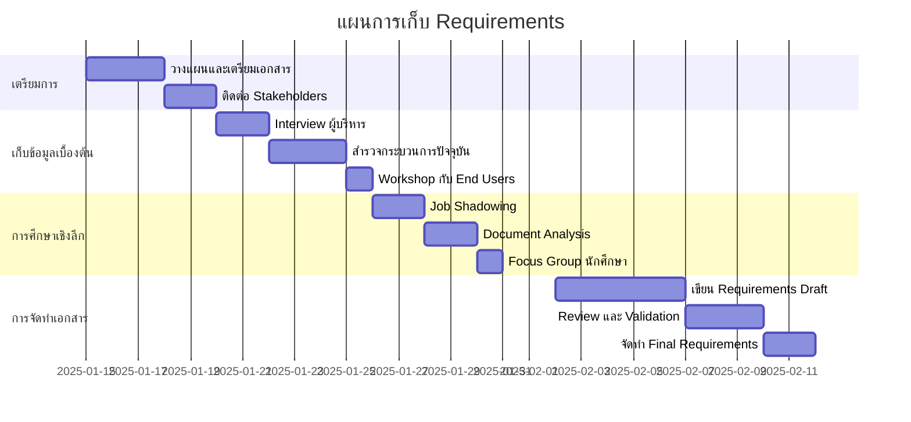

# คู่มือการเก็บ Requirements ของระบบอย่างละเอียด

## ภาพรวม

การเก็บ Requirements เป็นขั้นตอนสำคัญที่สุดในการพัฒนาระบบ การทำให้ถูกต้องและครบถ้วนจะส่งผลโดยตรงต่อความสำเร็จของโปรเจค คู่มือนี้จะแนะนำขั้นตอนและวิธีการที่ผ่านการพิสูจน์แล้วในการเก็บ Requirements อย่างเป็นระบบ

---

## 1. การวางแผนการเก็บ Requirements

### 1.1 การกำหนดเป้าหมายและขอบเขต

```markdown
## Project Charter Template

### ข้อมูลพื้นฐานโปรเจค
- **ชื่อโปรเจค**: ระบบขอเอกสารออนไลน์
- **Project Sponsor**: [ชื่อผู้อุปถัมภ์]
- **Product Owner**: [ชื่อ Product Owner]
- **Business Analyst**: [ชื่อ BA]
- **วันที่เริ่มต้น**: [วันที่]
- **วันที่คาดว่าจะเสร็จ**: [วันที่]

### วัตถุประสงค์ทางธุรกิจ
1. ลดเวลาในการประมวลผลคำขอเอกสารจาก X วัน เหลือ Y วัน
2. เพิ่มความพึงพอใจของนักศึกษาจาก X% เป็น Y%
3. ลดต้นทุนการดำเนินงานร้อยละ X

### ขอบเขตของระบบ (In Scope)
- ระบบการส่งคำขอเอกสารออนไลน์
- ระบบการอนุมัติแบบลำดับขั้น
- ระบบแจ้งเตือนอัตโนมัติ
- ระบบการชำระเงินออนไลน์
- ระบบรายงานและสถิติ

### สิ่งที่ไม่อยู่ในขอบเขต (Out of Scope)
- การจัดส่งเอกสารทางไปรษณีย์
- ระบบจัดการข้อมูลนักศึกษา (ใช้ระบบเดิม)
- ระบบบัญชีและการเงิน (integrate เท่านั้น)
```

### 1.2 การระบุผู้มีส่วนได้ส่วนเสีย (Stakeholder Identification)

```typescript
interface Stakeholder {
  name: string;
  role: string;
  influence: 'High' | 'Medium' | 'Low';
  interest: 'High' | 'Medium' | 'Low';
  availability: string;
  contactInfo: string;
  primaryConcerns: string[];
}

// ตัวอย่าง Stakeholder Matrix
const stakeholders: Stakeholder[] = [
  {
    name: "ผู้อำนวยการหน่วยทะเบียน",
    role: "Primary Sponsor",
    influence: "High",
    interest: "High", 
    availability: "2 ชั่วโมง/สัปดาห์",
    contactInfo: "email@university.edu",
    primaryConcerns: ["ประสิทธิภาพการทำงาน", "ต้นทุน", "ความพึงพอใจผู้ใช้"]
  },
  {
    name: "เจ้าหน้าที่ทะเบียน",
    role: "End User",
    influence: "Medium",
    interest: "High",
    availability: "4 ชั่วโมง/สัปดาห์", 
    contactInfo: "staff@university.edu",
    primaryConcerns: ["ความง่ายในการใช้งาน", "ปริมาณงาน", "ความถูกต้อง"]
  },
  {
    name: "นักศึกษา",
    role: "Primary User",
    influence: "Low",
    interest: "High",
    availability: "ตามที่ติดต่อได้",
    contactInfo: "ผ่าน Student Council",
    primaryConcerns: ["ความสะดวก", "ความรวดเร็ว", "ค่าใช้จ่าย"]
  }
];
```

### 1.3 การวางแผนกิจกรรมการเก็บ Requirements



---

## 2. วิธีการและเทคนิคการเก็บ Requirements

### 2.1 การสัมภาษณ์ (Interviews)

#### Template สำหรับการสัมภาษณ์ผู้บริหาร

```markdown
## Executive Interview Guide

### ข้อมูลผู้ให้สัมภาษณ์
- **ชื่อ**: _______________
- **ตำแหน่ง**: _______________
- **วันที่**: _______________
- **ระยะเวลา**: _______________

### คำถามเกี่ยวกับ Vision และ Strategy
1. อะไรคือแรงจูงใจหลักในการพัฒนาระบบนี้?
2. คุณคาดหวังผลลัพธ์อะไรจากระบบนี้?
3. มาตรฐานในการวัดความสำเร็จคืออะไร?
4. งงบประมาณและ timeline ที่คาดหวังเป็นอย่างไร?
5. มีข้อจำกัดหรือเงื่อนไขพิเศษอะไรบ้าง?

### คำถามเกี่ยวกับ Current State
6. กระบวนการปัจจุบันมีปัญหาอะไรบ้าง?
7. คุณคิดว่าสาเหตุหลักของปัญหาคืออะไร?
8. มีการพยายามแก้ไขปัญหามาก่อนหรือไม่? ผลเป็นอย่างไร?

### คำถามเกี่ยวกับ Future State  
9. คุณมองเห็นระบบในอนาคต 3 ปีเป็นอย่างไร?
10. มีแผนการขยายหรือพัฒนาเพิ่มเติมหรือไม่?

### การติดตาม
11. คุณต้องการรับรายงานความคืบหน้าแบบไหน?
12. ใครคือ contact person หลักสำหรับโปรเจคนี้?
```

#### Template สำหรับการสัมภาษณ์ End Users

```markdown
## End User Interview Guide - เจ้าหน้าที่ทะเบียน

### Current Workflow Analysis
1. โปรดอธิบายขั้นตอนการทำงานตั้งแต่รับคำขอจนส่งมอบเอกสาร
2. ในแต่ละขั้นตอน ใช้เวลาเท่าไหร่? มีปัญหาอะไรบ้าง?
3. เอกสารประเภทไหนที่ขอมากที่สุด? น้อยที่สุด?
4. ช่วงเวลาไหนที่งานเยอะที่สุด? น้อยที่สุด?

### Pain Points และ Challenges
5. อะไรคือปัญหาที่ท่านเจอมากที่สุดในการทำงานปัจจุบัน?
6. มีข้อผิดพลาดที่เกิดขึ้นบ่อยหรือไม่? เช่นอะไร?
7. มีงานไหนที่ท่านคิดว่าเสียเวลาโดยไม่จำเป็น?

### Desired Features
8. ถ้ามีระบบใหม่ ท่านอยากให้มีฟีเจอร์อะไรมากที่สุด?
9. ท่านต้องการดูข้อมูลสถิติหรือรายงานแบบไหน?
10. มีระบบอื่นที่ท่านต้องใช้ประกอบการทำงานหรือไม่?

### Technical Requirements
11. ท่านใช้อุปกรณ์อะไรในการทำงาน? (คอมพิวเตอร์, แท็บเล็ต, มือถือ)
12. มีข้อจำกัดด้านสิทธิ์การเข้าถึงข้อมูลหรือไม่?
13. ท่านคุ้นเคยกับการใช้ระบบออนไลน์แค่ไหน?
```

### 2.2 การสำรวจกระบวนการ (Process Discovery)

#### Current State Process Mapping

```markdown
## Process Mapping Worksheet

### กระบวนการ: การขอใบรับรองการเป็นนักศึกษา

| ลำดับ | กิจกรรม | ผู้รับผิดชอบ | เวลา | ปัญหา/ข้อสังเกต |
|-------|---------|--------------|------|-----------------|
| 1 | นักศึกษามารับแบบฟอร์ม | เจ้าหน้าที่ | 5 นาที | ต้องมาที่มหาวิทยาลัย |
| 2 | กรอกแบบฟอร์มและแนบเอกสาร | นักศึกษา | 15 นาที | บางครั้งกรอกไม่ครบ |
| 3 | ส่งแบบฟอร์มและชำระเงิน | นักศึกษา | 10 นาที | ต้องต่อคิวรอ |
| 4 | ตรวจสอบความถูกต้อง | เจ้าหน้าที่ | 5 นาที | พบความผิดพลาดบ่อย |
| 5 | ส่งให้อาจารย์ที่ปรึกษาอนุมัติ | เจ้าหน้าที่ | 1 วัน | รอนานเพราะหาอาจารย์ไม่เจอ |
| 6 | อาจารย์ตรวจสอบและลงนาม | อาจารย์ | 2-3 วัน | ขึ้นอยู่กับตารางงานอาจารย์ |
| 7 | จัดทำเอกสารและประทับตรา | เจ้าหน้าที่ | 30 นาที | - |
| 8 | แจ้งนักศึกษามารับเอกสาร | เจ้าหน้าที่ | - | บางครั้งติดต่อไม่ได้ |
| 9 | นักศึกษามารับเอกสาร | นักศึกษา | 5 นาที | ต้องมาอีกครั้ง |

### สรุปปัญหาหลัก:
- ใช้เวลารวม 3-4 วัน
- นักศึกษาต้องมา 3 ครั้ง
- ผิดพลาดจากการกรอกข้อมูล
- ติดต่ออาจารย์ยาก
- ไม่มีการติดตามสถานะ
```

### 2.3 การจัด Workshop

#### Workshop Planning Template

```markdown
## Requirements Workshop Plan

### ข้อมูลพื้นฐาน
- **วัตถุประสงค์**: กำหนด Functional Requirements สำหรับระบบขอเอกสารออนไลน์
- **วันที่**: [วันที่]
- **เวลา**: 09:00-16:00 (6 ชั่วโมง)
- **สถานที่**: ห้องประชุม A
- **Facilitator**: [ชื่อ Business Analyst]

### ผู้เข้าร่วม (8-12 คน)
- ผู้อำนวยการหน่วยทะเบียน (Decision Maker)
- เจ้าหน้าที่ทะเบียน 3 คน (Primary Users)
- อาจารย์ที่ปรึกษา 2 คน (Approvers)
- ตัวแทนนักศึกษา 2 คน (End Users)
- ผู้พัฒนาระบบ 1 คน (Technical Expert)
- Product Owner 1 คน

### Agenda

#### 09:00-09:30: Ice Breaking และ Overview
- แนะนำตัวและบทบาท
- วัตถุประสงค์ของ Workshop
- Ground Rules และ Expectations

#### 09:30-10:30: Current State Review
- นำเสนอผลการสำรวจกระบวนการปัจจุบัน
- ยืนยันและเพิ่มเติมข้อมูล
- ระบุ Pain Points ที่สำคัญที่สุด

#### 10:30-10:45: Coffee Break

#### 10:45-12:00: Future State Visioning
- การออกแบบ To-Be Process
- การระบุ Success Criteria
- การกำหนด Key Performance Indicators

#### 12:00-13:00: Lunch Break

#### 13:00-14:30: Feature Brainstorming
- ใช้เทคนิค MoSCoW (Must/Should/Could/Won't)
- การจัดกลุ่มและ prioritize features
- การระบุ dependencies

#### 14:30-14:45: Coffee Break

#### 14:45-15:45: User Story Development
- การเขียน User Stories สำหรับ High Priority Features
- การกำหนด Acceptance Criteria เบื้องต้น
- การประเมิน effort/complexity

#### 15:45-16:00: Wrap Up และ Next Steps
- สรุปผลการประชุม
- การมอบหมายงาน
- กำหนดการประชุมครั้งต่อไป
```

### 2.4 การสังเกตการทำงาน (Job Shadowing)

```markdown
## Job Shadowing Observation Sheet

### ข้อมูลการสังเกต
- **ผู้สังเกต**: _______________
- **ผู้ถูกสังเกต**: _______________
- **วันที่**: _______________
- **เวลา**: _______________

### การบันทึกการสังเกต

| เวลา | กิจกรรม | ผู้เกี่ยวข้อง | ระยะเวลา | ข้อสังเกต |
|------|---------|--------------|----------|-----------|
| 09:00 | ตรวจสอบคำขอที่เข้ามาใหม่ | เจ้าหน้าที่ | 15 นาที | ใช้ Excel ในการติดตาม |
| 09:15 | โทรหาอาจารย์เพื่อนัดอนุมัติ | เจ้าหน้าที่ + อาจารย์ | 10 นาที | โทรหลายครั้งถึงจะติดต่อได้ |
| 09:25 | ตรวจสอบความถูกต้องของเอกสาร | เจ้าหน้าที่ | 20 นาที | พบข้อผิดพลาด 3 จาก 5 ฉบับ |
| 09:45 | แก้ไขข้อมูลที่ผิดพลาด | เจ้าหน้าที่ | 15 นาที | ต้องโทรกลับไปหานักศึกษา |

### ข้อสังเกตสำคัญ
1. **เครื่องมือที่ใช้**: Excel, โทรศัพท์, แฟ้มเอกสาร
2. **จุดคอขวด**: การติดต่ออาจารย์, การตรวจสอบข้อมูล
3. **การใช้เวลา**: 60% ใช้เวลาในการติดต่อประสานงาน
4. **ข้อผิดพลาดที่พบ**: ข้อมูลไม่ครบ, เอกสารแนบผิด
5. **ความรู้สึกของผู้ใช้**: เครียดจากการต้องติดตามงานหลายเรื่องพร้อมกัน

### คำแนะนำ
- ควรมีระบบแจ้งเตือนอัตโนมัติ
- ควรมีการ validate ข้อมูลออนไลน์
- ควรมี dashboard สำหรับติดตามสถานะ
```

---

## 3. การจัดทำเอกสาร Requirements

### 3.1 Business Requirements Document (BRD)

```markdown
## Business Requirements Document

### 1. Executive Summary
ระบบขอเอกสารออนไลน์มีวัตถุประสงค์เพื่อแปลงกระบวนการขอเอกสารจากแบบ manual เป็น digital workflow ที่มีประสิทธิภาพ โดยคาดหวังที่จะลดเวลาการประมวลผลจาก 5-7 วัน เหลือ 2-3 วัน และเพิ่มความพึงพอใจของผู้ใช้จาก 60% เป็น 85%

### 2. Business Objectives
#### Primary Objectives
- **BR-001**: ลดเวลาการประมวลผลคำขอลง 50%
- **BR-002**: เพิ่มความพึงพอใจของนักศึกษาเป็น 85%
- **BR-003**: ลดต้นทุนการดำเนินงานลง 30%

#### Secondary Objectives  
- **BR-004**: ลดการใช้กระดาษลง 80%
- **BR-005**: เพิ่มความโปร่งใสในการติดตามสถานะ
- **BR-006**: สร้าง audit trail ที่สมบูรณ์

### 3. Success Criteria
| Metric | Current | Target | วิธีการวัด |
|--------|---------|--------|-----------|
| Average Processing Time | 5-7 วัน | 2-3 วัน | ระบบติดตาม |
| Customer Satisfaction | 60% | 85% | Survey รายเดือน |
| Error Rate | 15% | 5% | System logs |
| Staff Productivity | 20 คำขอ/วัน | 40 คำขอ/วัน | Dashboard |

### 4. Business Rules
#### BR-RULE-001: การอนุมัติ
- คำขอทุกรายการต้องผ่านการอนุมัติจากอาจารย์ที่ปรึกษาก่อน
- อาจารย์ที่ปรึกษาต้องตอบกลับภายใน 3 วันทำการ
- หากไม่ตอบกลับ ระบบจะ escalate ไปยังหัวหน้าภาค

#### BR-RULE-002: การชำระเงิน
- นักศึกษาต้องชำระค่าธรรมเนียมก่อนที่จะดำเนินการประมวลผล
- การ refund จะทำได้เฉพาะกรณียกเลิกก่อนการอนุมัติ

#### BR-RULE-003: ความปลอดภัย
- เฉพาะเจ้าของคำขอและผู้ที่เกี่ยวข้องเท่านั้นที่เห็นข้อมูล
- ต้องมี audit log สำหรับการเข้าถึงข้อมูลทุกครั้ง
```

### 3.2 Functional Requirements Specification (FRS)

```markdown
## Functional Requirements Specification

### Module 1: User Management
#### FR-001: การลงทะเบียนและเข้าสู่ระบบ
**Description**: ผู้ใช้สามารถสร้างบัญชีและเข้าสู่ระบบได้

**Acceptance Criteria**:
- AC-001.1: นักศึกษาสามารถลงทะเบียนด้วยรหัสนักศึกษาและอีเมล
- AC-001.2: ระบบส่งอีเมลยืนยันการลงทะเบียน
- AC-001.3: ผู้ใช้สามารถ login ด้วย username/password
- AC-001.4: ระบบจำ session เป็นเวลา 2 ชั่วโมง
- AC-001.5: มีฟีเจอร์ "ลืมรหัสผ่าน" ที่ทำงานได้

**Priority**: Must Have
**Effort Estimate**: 5 Story Points

#### FR-002: การจัดการโปรไฟล์
**Description**: ผู้ใช้สามารถแก้ไขข้อมูลส่วนตัวได้

**Acceptance Criteria**:
- AC-002.1: ผู้ใช้สามารถแก้ไขชื่อ, เบอร์โทร, ที่อยู่
- AC-002.2: การเปลี่ยนอีเมลต้องยืนยันด้วยอีเมลใหม่
- AC-002.3: การเปลี่ยนรหัสผ่านต้องใส่รหัสเก่า
- AC-002.4: ระบบบันทึก audit log การเปลี่ยนแปลง

**Priority**: Should Have
**Effort Estimate**: 3 Story Points

### Module 2: Document Request Management
#### FR-003: การสร้างคำขอเอกสาร
**Description**: นักศึกษาสามารถสร้างคำขอเอกสารออนไลน์ได้

**Pre-conditions**:
- ผู้ใช้ต้อง login เป็นนักศึกษา
- ไม่มีคำขอประเภทเดียวกันที่ pending อยู่

**Main Flow**:
1. นักศึกษาเลือกประเภทเอกสารจาก dropdown
2. ระบบแสดงแบบฟอร์มและค่าธรรมเนียม
3. นักศึกษากรอกข้อมูลที่จำเป็น
4. อัพโหลดเอกสารประกอบ (ถ้ามี)
5. ตรวจสอบและยืนยันข้อมูล
6. ชำระค่าธรรมเนียม
7. ระบบสร้างคำขอและส่งการแจ้งเตือน

**Acceptance Criteria**:
- AC-003.1: แสดงรายการประเภทเอกสารที่เปิดให้บริการ
- AC-003.2: Validate ข้อมูลที่กรอกตาม business rules
- AC-003.3: รองรับไฟล์แนบ PDF, JPG, PNG ขนาดไม่เกิน 5MB
- AC-003.4: สร้าง tracking number อัตโนมัติ
- AC-003.5: ส่งอีเมลยืนยันให้นักศึกษาและอาจารย์ที่ปรึกษา

**Priority**: Must Have
**Effort Estimate**: 8 Story Points

#### FR-004: การอนุมัติคำขอ
**Description**: อาจารย์ที่ปรึกษาและเจ้าหน้าที่สามารถอนุมัติคำขอได้

**Acceptance Criteria**:
- AC-004.1: แสดงรายการคำขอที่รออนุมัติ
- AC-004.2: สามารถดูรายละเอียดคำขอและเอกสารแนบ
- AC-004.3: สามารถอนุมัติหรือปฏิเสธพร้อมเหตุผล
- AC-004.4: ระบบส่งการแจ้งเตือนเมื่อมีการอนุมัติ/ปฏิเสธ
- AC-004.5: มี audit trail การอนุมัติ

**Priority**: Must Have
**Effort Estimate**: 6 Story Points
```

### 3.3 Non-Functional Requirements (NFR)

```markdown
## Non-Functional Requirements

### Performance Requirements
#### NFR-001: Response Time
- หน้าเว็บทั่วไปต้องโหลดเสร็จภายใน 3 วินาที
- การค้นหาต้องแสดงผลภายใน 5 วินาที
- การอัพโหลดไฟล์ 5MB ต้องเสร็จภายใน 30 วินาที

#### NFR-002: Throughput
- ระบบต้องรองรับผู้ใช้พร้อมกัน 100 คน
- สามารถประมวลผลคำขอได้ 1,000 รายการต่อวัน
- Database query ต้องเสร็จภายใน 2 วินาที

### Security Requirements
#### NFR-003: Authentication & Authorization
- ใช้ JWT token มีอายุ 2 ชั่วโมง
- Password ต้องมีความซับซ้อนตามมาตรฐาน
- มี role-based access control (RBAC)
- ต้องมี two-factor authentication สำหรับ admin

#### NFR-004: Data Protection
- ข้อมูลส่วนบุคคลต้องเข้ารหัสด้วย AES-256
- การเชื่อมต่อต้องใช้ HTTPS/TLS 1.3
- ต้องมี data backup รายวัน
- Audit log ต้องเก็บไว้ 7 ปี

### Usability Requirements
#### NFR-005: User Experience
- ผู้ใช้ใหม่ต้องสามารถสร้างคำขอได้โดยไม่ต้องอบรม
- หน้าจอต้องใช้งานได้บนมือถือ (responsive design)
- รองรับภาษาไทยและอังกฤษ
- ต้องมี accessibility สำหรับผู้พิการ (WCAG 2.1 AA)

### Availability Requirements
#### NFR-006: System Availability
- ระบบต้องพร้อมใช้งาน 99.5% ของเวลา
- Planned downtime ไม่เกิน 4 ชั่วโมงต่อเดือน
- มี disaster recovery plan (RTO: 4 ชั่วโมง, RPO: 1 ชั่วโมง)

### Compatibility Requirements
#### NFR-007: Browser Support
- รองรับ Chrome 90+, Firefox 85+, Safari 14+, Edge 90+
- รองรับ iOS Safari และ Chrome บน Android
- ไม่รองรับ Internet Explorer

#### NFR-008: Integration
- ต้องเชื่อมต่อกับระบบข้อมูลนักศึกษาปัจจุบัน (API)
- ต้องเชื่อมต่อกับระบบการเงิน (Payment Gateway)
- รองรับการส่งออกข้อมูลเป็น Excel/PDF
```

---

## 4. การ Validate และ Verify Requirements

### 4.1 Requirements Review Checklist

```markdown
## Requirements Quality Checklist

### ความชัดเจน (Clarity)
- [ ] Requirement เขียนในประโยคที่เข้าใจง่าย
- [ ] ไม่มีคำศัพท์คลุมเครือเช่น "ระบบควรจะ", "ใช้งานได้ดี"
- [ ] มีตัวอย่างหรือ scenario ประกอบ
- [ ] ใช้ภาษาที่ consistent กันทั้งเอกสาร

### ความสมบูรณ์ (Completeness)
- [ ] ครอบคลุม functional requirements ทั้งหมด
- [ ] มี non-functional requirements ที่จำเป็น
- [ ] มี exception handling และ error cases
- [ ] ระบุ constraints และ assumptions

### ความถูกต้อง (Correctness)
- [ ] Requirements สะท้อนความต้องการจริงของ stakeholders
- [ ] ไม่มีข้อมูลที่ขัดแย้งกัน
- [ ] Business rules ถูกต้องตามนolicy
- [ ] Technical constraints เป็นไปได้

### ความสามารถในการติดตาม (Traceability)
- [ ] แต่ละ requirement มี unique ID
- [ ] เชื่อมโยงกับ business objective
- [ ] สามารถ trace ถึง test case ได้
- [ ] มี impact analysis เมื่อมีการเปลี่ยนแปลง

### ความสามารถในการทดสอบ (Testability)
- [ ] มี acceptance criteria ที่วัดได้
- [ ] สามารถเขียน test case ได้
- [ ] มีเงื่อนไขที่ชัดเจนสำหรับ pass/fail
- [ ] Performance criteria มีตัวเลขที่ชัดเจน
```

### 4.2 Requirements Validation Techniques

```markdown
## Requirements Validation Plan

### 1. Stakeholder Review
**วัตถุประสงค์**: ให้ stakeholders ตรวจสอบความถูกต้อง

**กิจกรรม**:
- ส่งเอกสาร requirements ให้ stakeholders review
- จัด review meeting แยกตาม role
- รวบรวม feedback และจัดทำ action items
- Update requirements ตาม feedback

**Timeline**: 1 สัปดาห์
**Success Criteria**: Approval จาก stakeholders อย่างน้อย 80%

### 2. Prototype Validation
**วัตถุประสงค์**: ใช้ prototype ทดสอบความเข้าใจ

**กิจกรรม**:
- สร้าง wireframe/mockup สำหรับ key functions
- ให้ end users ทดลองใช้ prototype
- เก็บ feedback เกี่ยวกับ usability และ functionality
- ปรับปรุง requirements ตาม findings

**Timeline**: 2 สัปดาห์
**Success Criteria**: SUS Score > 70

### 3. Requirements Walkthrough
**วัตถุประสงค์**: ตรวจสอบความสมบูรณ์และความสอดคล้อง

**ผู้เข้าร่วม**:
- Business Analyst (Facilitator)
- Product Owner
- Technical Lead
- QA Lead
- Key stakeholders (2-3 คน)

**Process**:
1. อ่าน requirements ทีละ section
2. ถามคำถามและหาข้อขัดแย้ง
3. บันทึก issues และ action items
4. จัด priority การแก้ไข

### 4. Acceptance Criteria Review
**วัตถุประสงค์**: ตรวจสอบความสามารถในการทดสอบ

**เกณฑ์การตรวจสอบ**:
- [ ] Given-When-Then format ที่ชัดเจน
- [ ] มีการ cover positive และ negative cases
- [ ] สามารถ automate test ได้
- [ ] มี performance criteria ที่วัดได้
```

---

## 5. การจัดการ Requirements Change

### 5.1 Change Request Process

```markdown
## Requirements Change Management Process

### Change Request Form
**CR-ID**: CR-2025-001
**Date**: 2025-01-15
**Requestor**: John Doe (Product Owner)
**Priority**: High

**Current Requirement**:
FR-003: การสร้างคำขอเอกสาร - นักศึกษาสามารถอัพโหลดไฟล์แนบได้ 1 ไฟล์

**Proposed Change**:
อนุญาตให้อัพโหลดได้หลายไฟล์ (สูงสุด 5 ไฟล์)

**Business Justification**:
นักศึกษาบางคนต้องแนบเอกสารหลายฉบับ เช่น transcript จากหลายมหาวิทยาลัย

**Impact Analysis**:
- **Technical**: ต้องแก้ไข UI และ backend validation
- **Effort**: 3 story points เพิ่มเติม
- **Timeline**: +2 วัน
- **Cost**: +20,000 บาท
- **Risk**: Low - การเปลี่ยนแปลงไม่ซับซ้อน

**Dependencies**:
- ต้องอัพเดท file storage capacity
- ต้องแก้ไข acceptance criteria

**Decision**: 
- [ ] Approved
- [ ] Rejected  
- [ ] Deferred to next release

**Approval**:
- Product Owner: _________________ Date: _______
- Technical Lead: ________________ Date: _______
- Project Manager: _______________ Date: _______
```

### 5.2 Requirements Traceability Matrix

```markdown
## Requirements Traceability Matrix

| Business Objective | Business Requirement | Functional Requirement | Design Element | Test Case |
|-------------------|---------------------|----------------------|---------------|-----------|
| BR-001: ลดเวลา 50% | BR-REQ-001: Automated workflow | FR-003: สร้างคำขอ | UI-001: Request form | TC-001 |
| BR-001: ลดเวลา 50% | BR-REQ-001: Automated workflow | FR-004: อนุมัติออนไลน์ | API-001: Approval API | TC-002 |
| BR-002: เพิ่มความพึงพอใจ | BR-REQ-002: User-friendly interface | FR-001: ลงทะเบียน | UI-002: Login page | TC-003 |
| BR-002: เพิ่มความพึงพอใจ | BR-REQ-003: Status tracking | FR-005: ติดตามสถานะ | UI-003: Status dashboard | TC-004 |
| BR-003: ลดต้นทุน 30% | BR-REQ-004: Paperless process | FR-006: Digital document | SYS-001: File storage | TC-005 |

### Change Impact Matrix

| Requirement ID | Dependencies | Impacted Elements | Change Effort |
|---------------|--------------|------------------|---------------|
| FR-003 | FR-004, FR-005 | UI-001, API-002, TC-001 | Medium |
| FR-004 | FR-003, FR-006 | API-001, SYS-002, TC-002 | High |
| NFR-001 | FR-003, FR-004 | INFRA-001, TC-010 | Low |
```

---

## 6. Tools และ Templates

### 6.1 Recommended Tools

```yaml
Requirements Management:
  - Azure DevOps / Jira: สำหรับจัดการ requirements และ traceability
  - Confluence: สำหรับเอกสาร requirements
  - Lucidchart/Draw.io: สำหรับ process mapping และ diagrams

Collaboration:
  - Microsoft Teams/Slack: สำหรับการสื่อสาร
  - Miro/Mural: สำหรับ virtual workshops
  - Loom: สำหรับบันทึก demo และ feedback

Prototyping:
  - Figma/Adobe XD: สำหรับ UI mockups
  - InVision/Marvel: สำหรับ interactive prototypes
  - Balsamiq: สำหรับ low-fidelity wireframes

Documentation:
  - GitBook/Notion: สำหรับ requirements documentation
  - Markdown: สำหรับ version control ได้
  - Google Docs: สำหรับ collaborative writing
```

### 6.2 Template Repository

```markdown
## Template Collection

### 📋 Interview Templates
- [Executive Interview Guide](#executive-interview-template)
- [End User Interview Guide](#end-user-interview-template)
- [Technical Interview Guide](#technical-interview-template)

### 📊 Analysis Templates
- [Current State Process Map](#process-mapping-template)
- [Stakeholder Analysis Matrix](#stakeholder-matrix-template)
- [Requirements Traceability Matrix](#traceability-matrix-template)

### 📝 Documentation Templates
- [Business Requirements Document](#brd-template)
- [Functional Requirements Specification](#frs-template)
- [User Story Template](#user-story-template)

### ✅ Review Templates
- [Requirements Review Checklist](#review-checklist-template)
- [Change Request Form](#change-request-template)
- [Sign-off Document](#signoff-template)

### 📈 Tracking Templates
- [Requirements Status Dashboard](#status-dashboard-template)
- [Issue Log](#issue-log-template)
- [Risk Register](#risk-register-template)
```

---

## 7. Best Practices และ Lessons Learned

### 7.1 Best Practices

```markdown
## Requirements Gathering Best Practices

### การเตรียมการ
✅ **ทำการบ้านก่อนพบ stakeholders**
- ศึกษาองค์กรและ domain knowledge
- เตรียมคำถามล่วงหน้า
- รวบรวมเอกสารที่เกี่ยวข้อง

✅ **กำหนดโครงสร้างการประชุมที่ชัดเจน**
- มี agenda และ timeline
- กำหนดบทบาทของแต่ละคน
- เตรียม template สำหรับบันทึก

### การสื่อสาร
✅ **ใช้ภาษาที่ stakeholders เข้าใจ**
- หลีกเลี่ยงคำศัพท์ทางเทคนิค
- ใช้ตัวอย่างจากงานจริง
- วาดภาพหรือ diagram ประกอบ

✅ **Active listening และ confirmation**
- สรุปสิ่งที่ได้ยินกลับไป
- ถามคำถามเพื่อ clarify
- บันทึกและส่งกลับไปให้ตรวจสอบ

### การจัดการข้อมูล
✅ **จัดกลุ่มและจัดลำดับความสำคัญ**
- ใช้เทคนิค MoSCoW (Must/Should/Could/Won't)
- จัดกลุ่มตาม business process
- ระบุ dependencies ระหว่าง requirements

✅ **เก็บ audit trail ที่สมบูรณ์**
- บันทึก decision และเหตุผล
- เก็บ version history
- ระบุ source ของแต่ละ requirement

### การ Validation
✅ **ใช้หลากหลายวิธีในการ validate**
- Paper prototype สำหรับ UI requirements
- Scenario walkthrough สำหรับ business process
- Data model review สำหรับ data requirements

✅ **Involve end users ตั้งแต่เริ่มต้น**
- ให้ end users เป็นส่วนหนึ่งของ team
- จัด regular demo และรับ feedback
- ทำ user acceptance testing ก่อน go-live
```

### 7.2 Common Pitfalls และการแก้ไข

```markdown
## Common Pitfalls และการป้องกัน

### ❌ Pitfall 1: ข้อมูลไม่ครบถ้วน
**สาเหตุ**: รีบเร่งหรือไม่ได้คุยกับ stakeholders ที่หลากหลาย

**ผลกระทบ**: ต้องกลับมาแก้ไขงานที่ทำไปแล้ว

**วิธีแก้ไข**:
- จัดทำ stakeholder map ให้ครบ
- ใช้หลายวิธีในการเก็บข้อมูล (interview + workshop + observation)
- มี checkpoint reviews ตลอดการทำงาน

### ❌ Pitfall 2: Requirements ที่คลุมเครือ
**สาเหตุ**: ไม่ได้ dig deep หรือใช้ภาษาที่ไม่ชัดเจน

**ผลกระทบ**: Developer เข้าใจผิด, ทำผลงานไม่ตรงต้องการ

**วิธีแก้ไข**:
- ใช้ SMART criteria (Specific, Measurable, Achievable, Relevant, Time-bound)
- เขียน acceptance criteria ที่ testable
- ทำ prototype หรือ mockup ประกอบ

### ❌ Pitfall 3: Scope Creep
**สาเหตุ**: ไม่มีกระบวนการ change management ที่ชัดเจน

**ผลกระทบ**: โปรเจคล่าช้า, งบประมาณเกิน

**วิธีแก้ไข**:
- กำหนด change control process ตั้งแต่เริ่มต้น
- มี change request form และ approval process
- ทำ impact analysis ก่อนตัดสิน

### ❌ Pitfall 4: ไม่ได้ involve end users
**สาเหตุ**: คิดว่า management requirements เพียงพอ

**ผลกระทบ**: ระบบที่ทำออกมาใช้งานยาก

**วิธีแก้ไข**:
- สัมภาษณ์และ observe end users ในการทำงานจริง
- ให้ end users เป็น part ของ requirements review
- ทำ usability testing ก่อน release

### ❌ Pitfall 5: Over-engineering
**สาเหตุ**: เก็บ requirements ที่ไม่จำเป็นหรือซับซ้อนเกินไป

**ผลกระทบ**: เสียเวลาและต้นทุนเปล่า

**วิธีแก้ไข**:
- เริ่มจาก MVP (Minimum Viable Product)
- ใช้ MoSCoW method ในการ prioritize
- Focus ที่ business value และ ROI
```

### 7.3 Success Metrics สำหรับ Requirements Process

```markdown
## Requirements Process Metrics

### Quality Metrics
| Metric | Target | Current | วิธีการวัด |
|--------|--------|---------|-----------|
| Requirements Stability | <10% change | 8% | จำนวน changes/total requirements |
| Defect Density | <5 defects/requirement | 3 | Defects found in testing |
| Requirements Coverage | 100% | 95% | Test cases covering requirements |
| Stakeholder Satisfaction | >4.0/5.0 | 4.2 | Survey score |

### Process Metrics
| Metric | Target | Current | วิธีการวัด |
|--------|--------|---------|-----------|
| Requirements Gathering Time | 15% of project | 12% | Hours spent/total project hours |
| Review Cycle Time | <5 days | 3 days | Time from draft to approval |
| Change Response Time | <2 days | 1.5 days | Time to assess change impact |
| Stakeholder Participation | >80% | 85% | Meeting attendance rate |

### Outcome Metrics
- **Project Success Rate**: 85% (projects delivered on time/budget)
- **User Adoption Rate**: 90% (users actively using the system)
- **Business Value Delivered**: 120% (actual vs projected ROI)
- **Customer Satisfaction**: 4.3/5.0 (post-implementation survey)
```

---

## 8. ตัวอย่างการประยุกต์ใช้

### 8.1 Case Study: ระบบขอเอกสารออนไลน์

```markdown
## Case Study: การเก็บ Requirements ระบบขอเอกสารออนไลน์

### Background
มหาวิทยาลัย ABC ต้องการแปลงกระบวนการขอเอกสารจาก manual เป็น digital เพื่อรองรับนักศึกษา 15,000 คน

### Challenges
- Stakeholders หลากหลาย (5 คณะ, 20 ภาควิชา)
- กระบวนการซับซ้อน (หลายขั้นตอนการอนุมัติ)
- ข้อจำกัดด้าน budget และ timeline

### Approach ที่ใช้

#### Phase 1: Stakeholder Analysis (1 สัปดาห์)
**Activities**:
- จัดทำ stakeholder map
- Interview ผู้บริหาร 5 คน
- Focus group กับเจ้าหน้าที่ 15 คน

**Key Findings**:
- เป้าหมายหลัก: ลดเวลาจาก 7 วัน เป็น 3 วัน
- Pain points: การติดต่อประสาน, ข้อผิดพลาด, ไม่มีการติดตาม
- Constraints: งบประมาณ 2 ล้านบาท, เสร็จภายใน 6 เดือน

#### Phase 2: Current State Analysis (2 สัปดาห์)
**Activities**:
- Process mapping กับ 3 ประเภทเอกสารหลัก
- Job shadowing เจ้าหน้าที่ 3 วัน
- เก็บข้อมูล quantitative (เวลา, ปริมาณ, ข้อผิดพลาด)

**Key Findings**:
- Processing time: เฉลี่ย 6.5 วัน (range: 3-14 วัน)
- Error rate: 18% (ส่วนใหญ่มาจากข้อมูลไม่ครบ)
- Peak period: สัปดาห์แรกของเทอม (300 คำขอ/วัน)

#### Phase 3: Requirements Definition (3 สัปดาห์)
**Activities**:
- Workshop 2 วัน กับ key stakeholders
- User story writing sessions
- Prototype validation

**Key Outputs**:
- 45 functional requirements
- 15 non-functional requirements
- 120 user stories
- UI wireframes

#### Phase 4: Validation และ Sign-off (1 สัปดาห์)
**Activities**:
- Requirements walkthrough กับแต่ละ stakeholder group
- Prototype demo และ feedback collection
- Final review และ sign-off

**Results**:
- 98% stakeholder approval
- 15 minor changes requested
- Clear roadmap สำหรับ development

### Lessons Learned

#### What Worked Well
✅ **การใช้ mixed methods**: Interview + workshop + observation ให้ข้อมูลที่ครบถ้วน

✅ **การมี dedicated Product Owner**: คนที่สามารถตัดสินใจได้เร็ว

✅ **การทำ prototype เร็วๆ**: ช่วยให้ stakeholders เห็นภาพและให้ feedback ได้ดี

#### What Could Be Improved
❌ **ควรเก็บข้อมูล technical constraints ตั้งแต่เริ่มต้น**: มีผลต่อ design decisions

❌ **ควรมี change management plan ตั้งแต่แรก**: มี ad-hoc changes เยอะ

❌ **ควร involve security team เร็วกว่านี้**: พบ security requirements เพิ่มเติมในช่วงท้าย

### Final Results
- **Timeline**: เสร็จตรงเวลา (6 เดือน)
- **Budget**: ใช้งบ 1.8 ล้าน (90% ของงบ)
- **Quality**: 0 critical defects ใน production
- **User Satisfaction**: 4.4/5.0 หลัง go-live 3 เดือน
```

---

## 9. การติดตามและควบคุม

### 9.1 Requirements Dashboard

```markdown
## Requirements Management Dashboard

### Overview Metrics (Real-time)
```

```yaml
Total Requirements: 156
├── Functional: 112 (72%)
├── Non-Functional: 28 (18%)
└── Business Rules: 16 (10%)

Status Distribution:
├── Draft: 5 (3%)
├── Under Review: 12 (8%)
├── Approved: 125 (80%)
├── In Development: 45 (29%)
├── In Testing: 32 (21%)
└── Completed: 48 (31%)

Quality Indicators:
├── Reviewed: 151/156 (97%)
├── Tested: 80/125 (64%)
├── Traceable: 156/156 (100%)
└── Change Rate: 8% (Last 30 days)
```

### 9.2 Requirements Status Report Template

```markdown
## Weekly Requirements Status Report

**Report Period**: Jan 15-21, 2025
**Prepared by**: Business Analyst
**Distribution**: Project Stakeholders

### Executive Summary
- **Progress**: 85% of requirements completed testing
- **Key Achievement**: All high-priority requirements approved
- **Main Risk**: 3 requirements have dependency issues
- **Next Week Focus**: Complete remaining validation activities

### Detailed Status

#### Completed This Week
| Requirement ID | Title | Completed Activity |
|---------------|-------|-------------------|
| FR-001 | User Registration | Testing completed ✅ |
| FR-003 | Document Request | Development completed ✅ |
| NFR-002 | Performance | Validation completed ✅ |

#### In Progress
| Requirement ID | Title | Current Activity | ETA |
|---------------|-------|------------------|-----|
| FR-004 | Approval Workflow | Development | Jan 25 |
| FR-006 | Status Tracking | Testing | Jan 23 |
| NFR-001 | Security | Review | Jan 22 |

#### Blocked/Issues
| Requirement ID | Issue | Impact | Action Plan |
|---------------|-------|--------|-------------|
| FR-005 | Integration dependency | Medium | Wait for API spec (Jan 24) |
| NFR-003 | Infrastructure constraint | Low | Meeting with IT team |

### Change Requests
| CR-ID | Title | Status | Decision Date |
|-------|-------|--------|---------------|
| CR-001 | Multi-file upload | Under review | Jan 23 |
| CR-002 | SMS notification | Approved | Jan 20 |

### Risks และ Mitigation
| Risk | Probability | Impact | Mitigation |
|------|-------------|--------|------------|
| Late API delivery | Medium | High | Prepare mock data |
| Scope creep | Low | Medium | Strict change control |

### Next Week Plan
- Complete FR-004 development
- Start FR-007 analysis
- Review NFR-004 with security team
- Conduct stakeholder demo (Jan 26)
```

### 9.3 Product Owner Tracking Tools

```typescript
// Requirements Tracking Interface
interface RequirementTrackingDashboard {
  // Summary view for executives
  executiveSummary: {
    totalRequirements: number;
    completedPercentage: number;
    onTrackPercentage: number;
    riskLevel: 'Low' | 'Medium' | 'High';
    budgetUtilization: number;
    timelineStatus: 'On Track' | 'At Risk' | 'Delayed';
  };

  // Detailed view for Product Owner
  detailedView: {
    requirementsByPriority: RequirementGroup[];
    blockers: BlockedRequirement[];
    upcomingMilestones: Milestone[];
    teamVelocity: VelocityMetric[];
    qualityMetrics: QualityIndicator[];
  };

  // Action items view
  actionItems: {
    decisionsNeeded: DecisionItem[];
    reviewsPending: ReviewItem[];
    stakeholderFeedback: FeedbackItem[];
    changeRequests: ChangeRequest[];
  };
}

// Automated alerts
interface AlertSystem {
  triggers: {
    requirementBlocked: {
      condition: 'blocked_for > 2_days';
      notification: ['product_owner', 'project_manager'];
      escalation: 'stakeholder_meeting';
    };
    
    changeRequestPending: {
      condition: 'pending_for > 3_days';
      notification: ['product_owner'];
      escalation: 'auto_approve_if_low_impact';
    };
    
    testingDelayed: {
      condition: 'testing_delayed > 1_week';
      notification: ['qa_lead', 'product_owner'];
      escalation: 'resource_reallocation_meeting';
    };
  };
}
```

---

## 10. สรุปและแนวทางต่อไป

### 10.1 Key Success Factors

```markdown
## สรุปปัจจัยสำคัญต่อความสำเร็จ

### 1. การเตรียมการที่ดี
- **Stakeholder mapping ที่ครบถ้วน**: รู้ว่าใครคือคนสำคัญ
- **Clear objectives และ success criteria**: รู้ว่าอะไรคือความสำเร็จ  
- **Proper timeline และ resource allocation**: มีเวลาและคนทำงานเพียงพอ

### 2. การใช้วิธีการที่หลากหลาย
- **Multiple techniques**: Interview + Workshop + Observation + Prototype
- **Multiple perspectives**: Business + Technical + User + Operational
- **Multiple validation methods**: Review + Demo + Testing + Feedback

### 3. การสื่อสารที่มีประสิทธิภาพ
- **Clear documentation**: เขียนให้คนอื่นเข้าใจได้
- **Regular communication**: Update สม่ำเสมอ ไม่ให้คนหลงทาง
- **Visual aids**: ใช้ diagram, mockup, prototype ช่วยสื่อสาร

### 4. การจัดการการเปลี่ยนแปลง
- **Change control process**: มีกระบวนการชัดเจน
- **Impact analysis**: ประเมินผลกระทบก่อนตัดสิน
- **Stakeholder buy-in**: ให้ทุกคนเข้าใจและเห็นด้วย

### 5. การติดตามและควบคุม
- **Regular monitoring**: ติดตามความคืบหน้าสม่ำเสมอ
- **Quality assurance**: ตรวจสอบคุณภาพตลอดเวลา
- **Continuous improvement**: เรียนรู้และปรับปรุงตลอดเวลา
```

### 10.2 การพัฒนาความสามารถทีม

```markdown
## Development Path สำหรับ Requirements Team

### สำหรับ Business Analyst
#### Level 1: Foundation (0-2 ปี)
- [ ] เรียนรู้ requirements gathering techniques
- [ ] ฝึก interview และ facilitation skills
- [ ] เข้าใจ business domain
- [ ] เรียนรู้ tools (Jira, Confluence, etc.)

#### Level 2: Proficient (2-5 ปี)  
- [ ] Lead requirements workshops
- [ ] ทำ process improvement
- [ ] Mentor junior analysts
- [ ] เชี่ยวชาญ specific domain

#### Level 3: Expert (5+ ปี)
- [ ] Define requirements methodology
- [ ] Lead complex programs
- [ ] Stakeholder management
- [ ] Strategic planning

### สำหรับ Product Owner
#### Core Competencies
- [ ] Vision และ strategy development
- [ ] Stakeholder alignment
- [ ] Backlog prioritization
- [ ] ROI analysis
- [ ] Change leadership

#### Tools Mastery
- [ ] Product roadmapping tools
- [ ] Analytics และ metrics
- [ ] User research methods
- [ ] Financial planning

### Training Plan
**Month 1-2**: Foundation training
- Requirements fundamentals
- Interview techniques
- Documentation standards

**Month 3-4**: Hands-on practice
- Shadow senior analysts
- Lead small requirements sessions
- Practice writing requirements

**Month 5-6**: Independent work
- Lead full requirements gathering
- Handle change requests
- Stakeholder presentations

**Ongoing**: Continuous improvement
- Industry best practices
- New tools และ techniques
- Domain expertise building
```

### 10.3 Future Enhancements

```markdown
## แนวทางการพัฒนาต่อไป

### 1. Process Automation
- **AI-powered requirements analysis**: ใช้ AI ช่วยวิเคราะห์และหา pattern
- **Automated validation**: เช็คความสอดคล้องและครบถ้วนอัตโนมัติ
- **Smart templates**: Template ที่ปรับตามบริบทโปรเจค

### 2. Enhanced Collaboration
- **Real-time collaboration tools**: Workshop และ review แบบ virtual
- **Stakeholder self-service**: ให้ stakeholder update requirements เอง
- **Automated status reporting**: รายงานสถานะอัตโนมัติ

### 3. Data-Driven Insights
- **Requirements analytics**: วิเคราะห์ pattern และ trend
- **Predictive modeling**: ทำนายความเสี่ยงและผลกระทบ
- **Performance optimization**: ปรับปรุงกระบวนการจาก data

### 4. Integration และ Standardization
- **Tool integration**: เชื่อมต่อ tools ต่างๆ ให้ทำงานร่วมกัน
- **Standard methodologies**: มาตรฐานการทำงานทั่วทั้งองค์กร
- **Knowledge management**: รวบรวมและแชร์ knowledge

### 5. Quality Improvement
- **Continuous feedback loops**: รับ feedback และปรับปรุงอย่างต่อเนื่อง
- **Best practice sharing**: แบ่งปัน best practice ระหว่างโปรเจค
- **Training และ certification**: พัฒนาทักษะทีมอย่างเป็นระบบ
```

---

## สรุป

การเก็บ Requirements ที่ดีเป็นรากฐานสำคัญของการพัฒนาระบบที่ประสบความสำเร็จ คู่มือนี้ได้นำเสนอแนวทางที่ครอบคลุมตั้งแต่การวางแผน การเก็บข้อมูล การจัดทำเอกสาร การ validate และการจัดการการเปลี่ยนแปลง

### จุดสำคัญที่ต้องจำ:

1. **การเตรียมการเป็นสิ่งสำคัญ** - วางแผนให้ดี success ตามมา
2. **ใช้หลากหลายวิธี** - แต่ละวิธีให้ข้อมูลที่แตกต่างกัน
3. **การสื่อสารเป็นกุญแจ** - ทำให้ทุกคนเข้าใจตรงกัน
4. **การจัดการการเปลี่ยนแปลงต้องมีระบบ** - ป้องกัน scope creep
5. **การติดตามต้องต่อเนื่อง** - requirements ไม่ใช่งานที่ทำครั้งเดียวจบ

**การนำไปใช้จริง**: เริ่มจากการปรับ template และ process ให้เข้ากับบริบทองค์กร จากนั้นทดลองใช้กับโปรเจคเล็กๆ ก่อน แล้วค่อยขยายไปใช้กับโปรเจคใหญ่

**Success metrics**: วัดความสำเร็จจากคุณภาพของระบบที่ได้ ความพึงพอใจของผู้ใช้ และการส่งมอบตรงเวลาและงบประมาณ

---

*เอกสารนี้เป็น living document ที่ควรปรับปรุงและพัฒนาต่อไปตามประสบการณ์และ best practice ใหม่ๆ*
