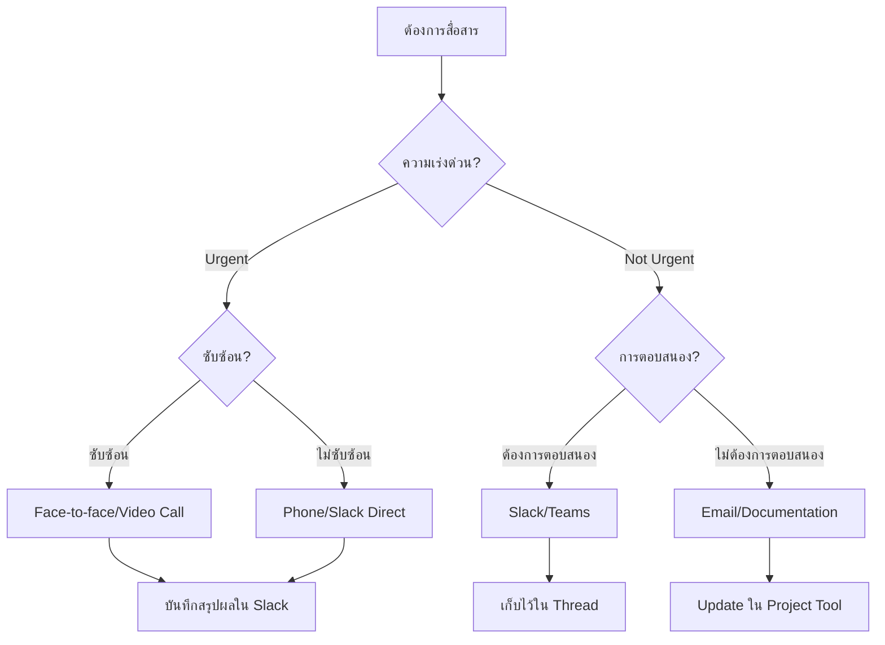

# Team Collaboration Processes - คู่มือการทำงานร่วมกันของทีมพัฒนา

## ภาพรวม

การทำงานร่วมกันอย่างมีประสิทธิภาพเป็นหัวใจสำคัญของการพัฒนา software ที่ประสบความสำเร็จ คู่มือนี้จะแนะนำกระบวนการ เครื่องมือ และวิธีการที่จะช่วยให้ทีมทำงานร่วมกันได้อย่างราบรื่นและมีประสิทธิภาพ

---

## 🎯 หลักการพื้นฐานของการทำงานเป็นทีม

### Core Values
```yaml
Transparency: "เปิดเผยข้อมูลและความคิดเห็นอย่างตรงไปตรงมา"
Respect: "เคารพความแตกต่างและความคิดเห็นของสมาชิกทุกคน"
Collaboration: "ทำงานร่วมกันเพื่อเป้าหมายรวม ไม่ใช่เพื่อตัวเอง"
Continuous Learning: "เรียนรู้และพัฒนาตัวเองอย่างต่อเนื่อง"
Ownership: "รับผิดชอบต่อผลงานและคุณภาพของทีม"
```

### Team Charter Template
```markdown
## Team Charter: [ชื่อทีม]

### Mission Statement
เราเป็นทีมที่มุ่งมั่นในการพัฒนาระบบขอเอกสารออนไลน์ที่มีคุณภาพสูง 
เพื่อให้ผู้ใช้ได้รับการบริการที่ดีและมีประสิทธิภาพ

### Team Goals
- ส่งมอบ features ตามกำหนดเวลาและคุณภาพที่ตกลงกัน
- รักษา code quality และ test coverage > 80%
- เรียนรู้และแบ่งปันความรู้ในทีม
- สร้างสภาพแพวดล้อมการทำงานที่เป็นมิตรและสร้างสรรค์

### Team Members & Roles
| ชื่อ | Role | ความรับผิดชอบหลัก | Skills/Expertise |
|-----|------|------------------|------------------|
| อภิชาติ | Tech Lead | Architecture, Code Review | React, Node.js, AWS |
| สุภัทรา | Senior Developer | Frontend Development | React, TypeScript, UX |
| วิทยา | Backend Developer | API Development | Node.js, PostgreSQL |
| นิรมล | DevOps Engineer | CI/CD, Infrastructure | Docker, Kubernetes |
| ประภา | QA Engineer | Testing, Quality Assurance | Automated Testing |

### Working Agreements
- Daily standup ทุกวันเวลา 09:30 AM
- Sprint length: 2 สัปดาห์
- Code review ต้องมีอย่างน้อย 2 approvals
- Response time ใน Slack ภายใน 4 ชั่วโมงในเวลาทำงาน
- No interruptions ในช่วง focus time (14:00-16:00)
- Documentation updates เป็นส่วนหนึ่งของ Definition of Done

### Communication Guidelines
- ใช้ภาษาที่สุภาพและเข้าใจง่าย
- ให้ข้อมูลและ context ที่เพียงพอในการสื่อสาร
- Feedback ต้องเป็นสร้างสรรค์และเจาะจงประเด็น
- ถามคำถามเมื่อไม่เข้าใจ ไม่ต้องกลัวว่าจะดูไม่รู้
```

---

## 💬 Communication Framework

### 1. การเลือกช่องทางการสื่อสาร



### 2. Slack Communication Guidelines

#### Channel Structure
```yaml
Development Channels:
  "#dev-general": "การสนทนาทั่วไปเกี่ยวกับการพัฒนา"
  "#dev-frontend": "Frontend development discussions"
  "#dev-backend": "Backend development discussions"
  "#dev-devops": "Infrastructure และ deployment"
  
Project Channels:
  "#project-document-system": "Project-specific discussions"
  "#project-standup": "Daily standup และ updates"
  "#project-releases": "Release announcements"
  
Support Channels:
  "#help-tech": "Technical help และ troubleshooting"
  "#help-process": "Process และ procedure questions"
  "#random": "Non-work related conversations"

Alert Channels:
  "#alerts-production": "Production alerts และ incidents"
  "#alerts-ci-cd": "Build และ deployment notifications"
```

#### Message Best Practices
```markdown
✅ Good Slack Messages:

"Hi @john, I'm working on the user authentication feature and need clarification 
on the password reset flow. 

Current understanding:
1. User clicks 'Forgot Password'
2. System sends email with reset link
3. User clicks link, redirected to reset form

Questions:
- Should the reset link expire? If so, how long?
- Do we need to invalidate existing sessions?

Context: Working on ticket #DEV-123
Priority: Medium (needed by Friday)

Thanks! 🙏"

❌ Poor Slack Messages:

"hey john quick question about passwords"
"@channel URGENT!!!! need help now"
"it's not working, can you fix it?"
```

#### Slack Etiquette
```yaml
Do's:
  - ใช้ threads สำหรับ discussions ยาวๆ
  - Tag คนที่เกี่ยวข้องเท่านั้น
  - ใช้ emoji reactions แทนการตอบ "ok", "thanks"
  - Set status เมื่อไม่อยู่หรือ focus time
  - Search ก่อนถามคำถามที่อาจเคยมีคนถามแล้ว

Don'ts:
  - อย่าใช้ @channel เว้นแต่จำเป็นจริงๆ
  - อย่าส่งข้อความหลายข้อความติดกัน (ใช้ shift+enter)
  - อย่าคาดหวัง response ทันทีนอกเวลาทำงาน
  - อย่าใช้ทั้ง caps lock
  - อย่าส่งข้อความที่คลุมเครือ
```

### 3. Video Call Best Practices

#### Meeting Types และ Guidelines
```yaml
Daily Standup (15 นาที):
  Format: "Yesterday, Today, Blockers"
  Rules:
    - เปิดกล้องทุกคน
    - ไม่แก้ปัญหาในที่ประชุม (park it)
    - ตรงเวลา เริ่ม-จบ
    - หากไม่มา ต้องส่ง update ใน Slack

Sprint Planning (2 ชั่วโมง):
  Preparation:
    - Backlog groomed ล่วงหน้า 1 วัน
    - Acceptance criteria ชัดเจน
    - Dependencies ระบุแล้ว
  
  Process:
    - Review sprint goal (15 นาที)
    - Select stories (45 นาที)
    - Break down tasks (45 นาที)
    - Finalize commitment (15 นาที)

Code Review Sessions:
  When: "Complex changes, architectural decisions"
  Who: "Author + 1-2 reviewers + optional interested parties"
  Format: "Screen share, walk through code, discuss improvements"

Knowledge Sharing Sessions:
  Frequency: "รายเดือน"
  Format: "Presentation + demo + Q&A"
  Topics: "New technologies, lessons learned, best practices"
```

#### Virtual Meeting Etiquette
```markdown
Before Meeting:
- [ ] Test audio/video เบื้องต้น
- [ ] เตรียมเอกสารและ materials ล่วงหน้า
- [ ] เข้าร่วม 2-3 นาทีก่อนเวลา
- [ ] อ่าน agenda และเตรียมคำถาม

During Meeting:
- [ ] Mute microphone เมื่อไม่พูด
- [ ] เปิดกล้องเพื่อแสดงการมีส่วนร่วม
- [ ] ใช้ "raise hand" feature หรือพิมพ์ในแชทก่อนพูด
- [ ] Stay focused - ไม่เล่น phone หรือทำงานอื่น
- [ ] Take notes สิ่งสำคัญ

After Meeting:
- [ ] ส่งสรุปประเด็นสำคัญใน Slack
- [ ] Update action items ใน project management tool
- [ ] Follow up กับคนที่ไม่ได้เข้าร่วม
```

---

## 🏃‍♂️ Agile Collaboration Practices

### 1. Scrum Events ที่มีประสิทธิภาพ

#### Daily Standup Framework
```markdown
## Daily Standup Template

### Standard Format (แต่ละคน 1-2 นาที):

**Yesterday:**
- ✅ Completed: [เฉพาะงานที่เสร็จจริง]
- 🔄 In Progress: [งานที่ยังทำอยู่]

**Today:**
- 🎯 Plan: [งานที่วางแผนจะทำวันนี้]
- 🤝 Collaboration: [ใครที่ต้องการ help หรือจะ help]

**Blockers:**
- 🚫 Blocked by: [อุปสรรคที่หยุดการทำงาน]
- ⚠️ Risks: [สิ่งที่อาจเป็นปัญหา]

### Example:
**Yesterday:**
- ✅ Completed user authentication API endpoints และ unit tests
- 🔄 Started working on password validation logic

**Today:** 
- 🎯 Complete password reset functionality
- 🤝 Planning to pair with @supattra on frontend integration

**Blockers:**
- 🚫 Waiting for email service credentials from DevOps
- ⚠️ Password reset email template not finalized

### Standup Anti-patterns to Avoid:
❌ "I'm working on the thing I was working on yesterday"
❌ Solving problems during standup
❌ Status reporting to manager แทน team sync
❌ งานที่ไม่เกี่ยวข้องกับ sprint goal
```

#### Sprint Retrospective Techniques

```markdown
## Retrospective Format 1: Start-Stop-Continue

### Preparation (5 นาที):
- ทุกคนเขียน sticky notes ใน 3 หมวด
- ไม่ต้องใส่ชื่อ เพื่อความสุจริตใจ

### Categories:
**🟢 START** - สิ่งที่ควรเริ่มทำ
- "เริ่มทำ code review ด้วย pair programming"
- "เริ่มใช้ automated testing มากขึ้น"
- "เริ่มจัด weekly tech sharing session"

**🔴 STOP** - สิ่งที่ควรหยุดทำ  
- "หยุดการ interrupt กันระหว่างวันโดยไม่จำเป็น"
- "หยุดการ commit code โดยไม่มี tests"
- "หยุดการนัดประชุมโดยไม่มี agenda"

**🟡 CONTINUE** - สิ่งที่ดีอยู่แล้ว ควรทำต่อ
- "การ document architectural decisions ใน ADR"
- "การใช้ feature flags สำหรับ deployment"
- "การ celebrate team achievements"

### Action Items:
- แต่ละ action item ต้องมี owner และ due date
- ไม่เกิน 3-5 action items ต่อ sprint
- Track progress ใน retrospective ครั้งต่อไป
```

```markdown
## Retrospective Format 2: Mad-Sad-Glad

### 😠 MAD (Frustrations):
- สิ่งที่ทำให้รู้สึกหงุดหงิดหรือโกรธ
- "การ deploy ที่ล้มเหลวบ่อยในช่วงสุดสัปดาห์"
- "Requirements ที่เปลี่ยนแปลงกลางคัน sprint"

### 😢 SAD (Disappointments):  
- สิ่งที่ทำให้ผิดหวังหรือเสียใจ
- "ไม่สามารถ complete sprint goal ได้ตามเป้า"
- "Code review feedback มาช้าทำให้ release ล่าช้า"

### 😊 GLAD (Celebrations):
- สิ่งที่ทำให้มีความสุขหรือภูมิใจ
- "ทีมช่วยเหลือกันดีเมื่อมีปัญหา"
- "User feedback เป็นบวกสำหรับ feature ใหม่"

### Root Cause Analysis:
สำหรับ issues ที่สำคัญ ใช้ "5 Whys" technique:
1. Why did the deployment fail?
2. Why wasn't the test environment updated?
3. Why didn't we catch this in CI?
4. Why isn't our CI comprehensive enough?
5. Why don't we have better test coverage?
```

### 2. Backlog Management และ Story Writing

#### User Story Best Practices
```markdown
## User Story Template

### Basic Format:
As a [type of user]
I want [goal/desire] 
So that [benefit/value]

### Example:
As a student
I want to receive email notifications when my document request status changes
So that I can track the progress without repeatedly checking the website

### Acceptance Criteria (Given-When-Then):
**Scenario 1: Request submitted**
Given I am a logged-in student
When I submit a new document request
Then I should receive an email confirmation within 5 minutes
And the email should contain my request tracking number
And the email should include next steps information

**Scenario 2: Status updated**  
Given I have a pending document request
When an advisor approves my request
Then I should receive an email notification within 15 minutes
And the email should clearly state the new status
And the email should include estimated completion date

**Scenario 3: Request completed**
Given my document request has been processed
When the document is ready for pickup/download
Then I should receive an email with pickup instructions or download link
And the email should include any additional requirements

### Definition of Ready Checklist:
- [ ] Story มี clear business value
- [ ] Acceptance criteria ชัดเจนและ testable
- [ ] Dependencies ระบุและ resolved แล้ว
- [ ] UI/UX mockups (ถ้าจำเป็น)
- [ ] Performance criteria (ถ้าจำเป็น)  
- [ ] Security considerations reviewed
- [ ] Estimated by team
- [ ] Fits within sprint capacity
```

#### Story Estimation Techniques
```markdown
## Planning Poker Process

### Fibonacci Scale: 1, 2, 3, 5, 8, 13, 21, 40, 100, ∞, ?

**Story Point Guidelines:**
- **1 point**: งานง่ายมาก ทำได้ใน 1-2 ชั่วโมง
  - "แก้ typo ใน documentation"
  - "เปลี่ยน color ของ button"

- **2 points**: งานเล็ก ทำได้ภายในครึ่งวัน
  - "เพิ่ม validation rule ง่ายๆ"
  - "แก้ไข error message"

- **3 points**: งานขนาดกลาง ทำได้ใน 1 วัน
  - "เพิ่ม API endpoint ง่ายๆ"
  - "สร้าง simple UI component"

- **5 points**: งานปานกลาง ทำได้ใน 2-3 วัน
  - "implement user authentication"
  - "สร้าง CRUD operations"

- **8 points**: งานใหญ่ ทำได้ใน 1 สัปดาห์
  - "File upload with validation"
  - "Email notification system"

- **13+ points**: งานซับซ้อน ควร break down ก่อน

### Estimation Meeting Process:
1. **Story Reading** (2 นาที): PO อ่าน story และ acceptance criteria
2. **Clarification** (3 นาที): ทีมถามคำถามและหารือ
3. **Individual Estimation** (1 นาที): ทุกคนเลือกการ์ดโดยไม่ให้ใครเห็น
4. **Reveal** (30 วินาที): แสดงการ์ดพร้อมกัน
5. **Discussion** (2-5 นาที): หารือความแตกต่าง โดยเฉพาะ highest/lowest
6. **Re-estimation** (1 นาที): estimate ใหม่จนได้ consensus
7. **Final Decision**: บันทึก final estimate

### Estimation Anti-patterns:
❌ ใช้ story points เป็น time estimates
❌ Compare estimates ระหว่างทีม
❌ Pressure ให้ estimate ต่ำ
❌ Manager/PO มีอิทธิพลต่อ estimation
```

---

## 🔧 Code Collaboration Practices

### 1. Code Review Process

#### Pull Request Template
```markdown
## Pull Request Template

### 📋 Description
Brief description of what this PR does and why.

**Related Issue:** [Closes #123]

### 🔄 Type of Change
- [ ] 🐛 Bug fix (non-breaking change which fixes an issue)
- [ ] ✨ New feature (non-breaking change which adds functionality)  
- [ ] 💥 Breaking change (fix or feature that would cause existing functionality to not work as expected)
- [ ] 📚 Documentation update
- [ ] 🎨 Code style/formatting
- [ ] ♻️ Refactoring
- [ ] ⚡ Performance improvement
- [ ] 🧪 Test addition/modification

### 🧪 Testing
- [ ] Unit tests added/updated
- [ ] Integration tests added/updated  
- [ ] Manual testing completed
- [ ] All tests passing

**Test Coverage:** X% (previous: Y%)

### 📸 Screenshots (if applicable)
Before: [screenshot]
After: [screenshot]

### ✅ Checklist
- [ ] Code follows team style guidelines
- [ ] Self-review completed
- [ ] Code is well documented
- [ ] No console.log or debug code left
- [ ] Database migrations tested (if applicable)
- [ ] Performance impact considered
- [ ] Security implications reviewed
- [ ] Documentation updated

### 🚀 Deployment Notes
Any special deployment considerations:
- Database migrations required: Yes/No
- Feature flags needed: Yes/No  
- Configuration changes: Yes/No
- Third-party service dependencies: Yes/No

### 🤔 Questions for Reviewers
Any specific areas you'd like feedback on:
- Architecture decisions
- Performance optimizations
- Security considerations
- Testing strategy
```

#### Code Review Guidelines
```yaml
Reviewer Responsibilities:

Time Commitment:
  - Respond to review requests within 24 hours
  - Complete reviews within 48 hours for non-urgent PRs
  - Prioritize blocking/urgent PRs

Review Focus Areas:
  Functionality:
    - Does the code solve the intended problem?
    - Are edge cases handled properly?
    - Is error handling adequate?
  
  Code Quality:
    - Is the code readable and maintainable?
    - Are functions/methods appropriately sized?
    - Are naming conventions followed?
    - Is there unnecessary code duplication?
  
  Architecture:
    - Does the change fit well with existing architecture?
    - Are design patterns used appropriately?
    - Is separation of concerns maintained?
  
  Performance:
    - Are there any obvious performance issues?
    - Is database usage optimized?
    - Are there memory leaks?
  
  Security:
    - Are inputs properly validated?
    - Are authentication/authorization checks in place?
    - Are secrets handled securely?
  
  Testing:
    - Are there adequate tests?
    - Do tests actually test the functionality?
    - Is test coverage maintained or improved?

Feedback Guidelines:
  Constructive: 
    ✅ "Consider using a Map here for O(1) lookup instead of array.find() for better performance"
    ❌ "This is slow"
  
  Specific:
    ✅ "Line 42: This function is doing too much. Consider extracting the validation logic into a separate function"
    ❌ "This function is too complex"
  
  Appreciative:
    ✅ "Nice implementation of the caching strategy! This should improve response times significantly"
    ❌ Only pointing out problems
```

#### Code Review Response Guide
```markdown
## How to Respond to Code Review Feedback

### 🟢 Agreeing with Feedback:
"Good catch! I'll refactor this to use the builder pattern."
"You're absolutely right about the performance concern. I'll add an index for this query."
"Thanks for the suggestion! I hadn't considered that edge case."

### 🟡 Asking for Clarification:
"Could you elaborate on the security concern you mentioned?"
"I'm not sure I understand the alternative approach you're suggesting. Could you provide an example?"
"What do you think would be a better way to handle this scenario?"

### 🔴 Respectfully Disagreeing:
"I considered that approach, but I think the current implementation is more maintainable because..."
"While I understand your concern, this approach was chosen to align with the existing pattern in [other file]. Would you prefer we refactor both?"
"I see your point about performance, but given our current load patterns, I think readability is more important here. What do you think?"

### 📝 Making Changes:
"Fixed in latest commit - changed to use async/await pattern"
"Extracted validation logic into separate utility function as suggested"
"Added the missing error handling and unit tests"

### 💬 General Response Etiquette:
- Respond to every comment (even if just "Fixed" or "Good point")
- Be gracious and professional
- Explain your reasoning when disagreeing
- Ask questions when unclear
- Thank reviewers for their time and insights
```

### 2. Pair Programming Guidelines

#### When to Pair Program
```yaml
Highly Recommended:
  - Complex algorithmic problems
  - Architecture decisions
  - Learning new technologies/frameworks
  - Debugging difficult issues
  - Code in unfamiliar parts of the system
  - Security-critical implementations
  - Performance optimization

Optional but Beneficial:
  - Regular feature development
  - Refactoring large code sections
  - Writing comprehensive tests
  - Onboarding new team members

Not Necessary:
  - Simple bug fixes
  - Documentation updates
  - Routine maintenance tasks
  - Independent research/learning
```

#### Pairing Techniques
```markdown
## Driver-Navigator Pattern

### 🚗 Driver Responsibilities:
- Control keyboard and mouse
- Type the code
- Focus on immediate implementation details
- Think about syntax and current step

### 🧭 Navigator Responsibilities:  
- Review code as it's being written
- Think about overall direction and strategy
- Spot potential issues early
- Keep track of things to remember
- Suggest improvements

### 🔄 Switching Roles:
- Switch every 25-30 minutes (Pomodoro technique)
- Switch when natural breakpoints occur
- Switch when one person gets stuck
- Both should be comfortable requesting a switch

## Pairing Session Structure:

### Before Starting (5 minutes):
- [ ] Agree on the goal and scope
- [ ] Set up shared environment (VS Code Live Share, etc.)
- [ ] Decide who starts as driver/navigator
- [ ] Set timer for role switching

### During Pairing:
- [ ] Communicate thoughts and reasoning out loud
- [ ] Ask questions when unclear
- [ ] Take breaks every hour
- [ ] Document important decisions

### After Pairing (5 minutes):
- [ ] Summarize what was accomplished
- [ ] Note any follow-up items
- [ ] Commit and push code
- [ ] Update relevant tickets/documentation
```

#### Remote Pairing Best Practices
```yaml
Tools:
  Screen Sharing: "Zoom, Teams, or specialized pairing tools"
  Code Sharing: "VS Code Live Share, CodeWithMe"
  Communication: "High-quality headset, good internet connection"

Setup:
  Video: "Keep cameras on for better collaboration"
  Audio: "Use push-to-talk or good noise cancellation"
  Environment: "Minimize distractions, close unnecessary apps"
  
Session Management:
  Duration: "Limit to 2-3 hours with breaks"
  Energy: "Monitor fatigue levels, remote pairing is more tiring"
  Documentation: "Take more notes than in-person pairing"
```

---

## 🌐 Remote Work Collaboration

### 1. Asynchronous Communication Strategies

#### Documentation-First Approach
```markdown
## Decision Documentation Template (ADR - Architecture Decision Records)

### ADR-001: Database Choice for Document Storage

**Status:** Accepted
**Date:** 2025-01-15
**Deciders:** Tech Lead, Senior Developers

#### Context
We need to choose a database for storing document request information and metadata. 
Current considerations include performance, scalability, team expertise, and cost.

#### Decision
We will use PostgreSQL as our primary database for the following reasons:

#### Consequences
**Positive:**
- Strong ACID compliance for financial/legal documents
- Excellent JSON support for flexible metadata
- Team has strong PostgreSQL experience
- Good performance for our expected load

**Negative:**  
- Slightly more complex setup than simple NoSQL solutions
- Requires more careful schema design upfront

#### Alternatives Considered
1. **MongoDB**: Rejected due to consistency requirements
2. **MySQL**: Rejected due to weaker JSON support  
3. **DynamoDB**: Rejected due to team expertise and cost

#### Implementation Notes
- Use TypeORM for database migrations
- Implement read replicas for reporting queries
- Regular backup strategy to S3

---

**Next Review Date:** 2025-07-15
**Related ADRs:** ADR-002 (Caching Strategy)
```

#### Asynchronous Standup Format
```markdown
## Daily Async Standup Template

**Date:** 2025-01-15
**Team Member:** John Doe

### Yesterday 📅
**Completed:**
- ✅ Implemented user authentication endpoints
- ✅ Added unit tests for login/logout functionality  
- ✅ Fixed bug in password validation (issue #DEV-123)

**Challenges:**
- 🚫 Struggled with JWT token refresh logic - spent 2 hours debugging
- ⚠️ Dependency injection setup more complex than expected

### Today 🎯
**Planned Work:**
- 🔲 Complete password reset functionality
- 🔲 Start integration with email service
- 🔲 Code review for @sarah's frontend changes

**Focus Time:** 
- 🧘 Deep work: 2:00 PM - 4:00 PM (password reset implementation)
- 💬 Available for questions: Before 12:00 PM and after 4:30 PM

### Blockers & Needs 🚧
**Blocked by:**
- Waiting for email service API keys from DevOps
- Need clarification on password policy requirements from Product

**Help Needed:**
- Could use a second pair of eyes on JWT implementation
- Looking for feedback on API response structure

**Can Help With:**
- Authentication/security questions
- Database schema design
- Code reviews

### Availability 🗓️
- **Core hours:** 9:00 AM - 5:00 PM (GMT+7)
- **Meetings:** Available 10:00 AM - 11:00 AM, 2:00 PM - 3:00 PM
- **Status:** 🟢 Available | 🟡 Busy | 🔴 Do Not Disturb | 🏖️ Out of Office

### Notes 📝
Working from home office today. Internet connection stable.
Planning to attend optional workshop on GraphQL at 4:00 PM.
```

### 2. Time Zone Management

#### Global Team Coordination
```yaml
Team Timezone Distribution:
  Bangkok (GMT+7): "3 developers"
  London (GMT+0): "2 developers" 
  New York (GMT-5): "1 product manager"

Core Overlap Hours:
  Primary: "09:00-11:00 Bangkok time (02:00-04:00 GMT)"
  Secondary: "14:00-16:00 Bangkok time (07:00-09:00 GMT)"

Meeting Schedule:
  Daily Standup: "09:30 Bangkok (02:30 GMT, 21:30 EST-1)"
  Sprint Planning: "09:00 Bangkok (02:00 GMT, 21:00 EST-1)" 
  Retrospective: "15:00 Bangkok (08:00 GMT, 03:00 EST)"

Async Windows:
  Bangkok Team: "Deep work 13:00-17:00 local time"
  London Team: "Deep work 14:00-18:00 local time"
  New York: "Review and planning 09:00-12:00 local time"
```

#### Follow-the-Sun Workflow
```markdown
## 24-Hour Development Cycle

### Bangkok Team (GMT+7) - 09:00-18:00
**Responsibilities:**
- New feature development
- Bug fixes for Asia-Pacific region
- Code reviews for London team's previous day work
- Documentation updates

**Handoff to London:**
- Update progress in shared dashboard
- Document any blockers for London team
- Push code changes to shared branches
- Update ticket status in Jira

### London Team (GMT+0) - 09:00-18:00  
**Responsibilities:**
- Code reviews for Bangkok team's work
- Integration work between features
- DevOps and infrastructure tasks
- Stakeholder communication for European clients

**Handoff to New York:**
- Deploy to staging environment
- Update product roadmap based on progress
- Prepare requirements for next iteration
- Document technical decisions

### New York Team (GMT-5) - 09:00-18:00
**Responsibilities:**
- Product planning and requirements
- Stakeholder communication for American clients  
- Strategic technical decisions
- Planning for next day's work

**Handoff to Bangkok:**
- Update product backlog priorities
- Clarify requirements for new features
- Review and approve architectural decisions
- Set goals for next 24-hour cycle
```

---

## 📚 Knowledge Sharing & Learning

### 1. Documentation Culture

#### Living Documentation Strategy
```yaml
Documentation Types:

README Files:
  Project Root: "Overview, setup instructions, basic architecture"
  Module Level: "Specific module functionality and API"
  Component Level: "Individual component usage and examples"

Technical Documentation:
  API Documentation: "OpenAPI/Swagger specs with examples"
  Architecture Docs: "High-level system design and decisions" 
  Deployment Guides: "Environment setup and deployment procedures"
  Troubleshooting: "Common issues and solutions"

Process Documentation:
  Team Playbooks: "How we work together"
  Incident Response: "What to do when things go wrong"
  Code Review Guidelines: "Standards and expectations"
  Testing Strategy: "Approach to quality assurance"

Knowledge Base:
  Lessons Learned: "Post-mortem summaries and insights"
  Best Practices: "Accumulated team wisdom"
  Technology Guides: "How to use specific tools/frameworks"
  Decision Records: "Why we made certain choices"
```

#### Documentation Best Practices
```markdown
## Writing Effective Documentation

### Structure Template:
1. **Purpose** - Why does this exist?
2. **Overview** - What does it do at a high level?
3. **Prerequisites** - What do you need to know first?
4. **Step-by-step Instructions** - How to use it
5. **Examples** - Real-world usage scenarios
6. **Troubleshooting** - Common problems and solutions
7. **Additional Resources** - Where to learn more

### Writing Guidelines:
✅ **Use active voice**: "Click the button" vs "The button should be clicked"
✅ **Include code examples**: Show don't just tell
✅ **Keep it current**: Update when code changes
✅ **Make it scannable**: Use headers, bullets, code blocks
✅ **Test your instructions**: Have someone else follow them

❌ **Avoid assumptions**: Don't assume background knowledge
❌ **Don't write wall of text**: Break up long paragraphs
❌ **Don't forget context**: Explain why, not just how
❌ **Don't make it stale**: Remove outdated information

### Documentation Review Process:
1. **Author writes** initial documentation
2. **Peer review** for accuracy and clarity  
3. **User testing** with someone unfamiliar
4. **Iterate** based on feedback
5. **Publish** to team knowledge base
6. **Maintain** with regular reviews
```

### 2. Learning Sessions & Tech Talks

#### Monthly Tech Talk Schedule
```markdown
## Tech Talk Format (30 minutes)

### Structure:
- **Introduction** (2 minutes): Speaker background and topic overview
- **Problem/Context** (5 minutes): Why is this relevant?
- **Solution/Technology** (15 minutes): How does it work?
- **Demo** (5 minutes): Show it in action
- **Q&A** (3 minutes): Questions and discussion

### Suggested Topics:
**Technology Deep Dives:**
- "GraphQL vs REST: When to use which?"
- "Database indexing strategies for performance"
- "Container orchestration with Kubernetes"
- "Frontend state management patterns"

**Process Improvements:**
- "Test-driven development in practice"
- "Effective code review techniques"  
- "Monitoring and observability best practices"
- "Security considerations for web applications"

**Lessons Learned:**
- "What we learned from our last production incident"
- "Refactoring legacy code: a case study"
- "Performance optimization journey"
- "Cross-team collaboration challenges and solutions"

### Learning Budget:
- **Conference attendance**: $2000 per person per year
- **Online courses**: Unlimited access to Pluralsight/Udemy
- **Books**: $500 per person per year
- **Certification exams**: Company sponsored for relevant certs
```

#### Knowledge Sharing Activities
```yaml
Regular Activities:

Weekly Show & Tell (Fridays 4:30 PM):
  Format: "Informal 10-minute demos"
  Content: "Cool thing you learned/built this week"
  Audience: "Entire team"
  Goal: "Share discoveries and stay connected"

Monthly Deep Dive (Last Friday):
  Format: "45-minute presentation + discussion"
  Content: "Technical topic or process improvement"
  Preparation: "Slides, demo environment, handouts"
  Follow-up: "Blog post or documentation"

Quarterly Innovation Day:
  Format: "Full day hackathon"
  Theme: "Experiment with new technologies"
  Output: "Prototype and learnings presentation"
  Benefits: "Learning stipend for best innovations"

Annual Tech Conference:
  Format: "Team attendance at major industry conference"
  Selection: "Vote on conference based on team interests"
  Commitment: "Share learnings with broader organization"
  Budget: "Full expenses covered for core team"

Ad-hoc Sessions:
  Pair Programming: "Learn by doing together"
  Code Walkthroughs: "Understand complex systems"
  Problem Solving: "Collaborate on tough challenges"
  Tool Training: "Learn new development tools"
```

---

## 🤝 Conflict Resolution & Feedback

### 1. Constructive Feedback Framework

#### SBI Model (Situation-Behavior-Impact)
```markdown
## Giving Effective Feedback

### SBI Framework:

**Situation**: Describe the specific context
"In yesterday's sprint planning meeting..."

**Behavior**: Describe the observable behavior
"When you interrupted Sarah three times while she was explaining the user story..."

**Impact**: Explain the impact on you, others, or the work
"It made it difficult for the team to understand the requirements, and I noticed Sarah seemed frustrated and didn't finish her explanation."

### Complete Examples:

#### ✅ Good Feedback:
"Hi John, I wanted to talk about yesterday's code review session. When you commented 'this is wrong' on my pull request without explaining why, it left me confused about what needed to be changed and feeling like my approach wasn't valued. Could you help me understand what specifically needs improvement?"

#### ❌ Poor Feedback:
"John, you're always negative in code reviews and never explain anything."

### Receiving Feedback:

#### The HEARD Model:
- **H**alt: Stop what you're doing and listen
- **E**ngage: Ask clarifying questions  
- **A**ffirm: Acknowledge what you've heard
- **R**espond: Share your perspective if needed
- **D**o: Commit to action if appropriate

#### Example Response:
"Thank you for bringing this up. I didn't realize my comments came across that way. You're right that I should explain my reasoning. Going forward, I'll make sure to provide context and suggest alternatives instead of just pointing out issues."
```

#### Regular Feedback Practices
```yaml
Feedback Mechanisms:

One-on-Ones (Bi-weekly):
  Duration: "30 minutes"
  Structure: "Personal check-in + work discussion + growth planning"
  Documentation: "Private notes, action items tracked"
  Focus: "Career development, blockers, team dynamics"

360-Degree Reviews (Quarterly):
  Process: "Anonymous feedback from peers, manager, direct reports"
  Areas: "Technical skills, collaboration, communication, leadership"
  Output: "Personal development plan with specific goals"
  Follow-up: "Progress review in subsequent one-on-ones"

Sprint Retrospectives:
  Focus: "Process improvement, not individual performance"
  Environment: "Safe space for honest discussion"
  Actions: "Team commits to specific improvements"

Real-time Feedback:
  Encourage: "Immediate feedback on specific situations"
  Channel: "Direct conversation or private message"
  Approach: "Assume positive intent, focus on behavior"
```

### 2. Conflict Resolution Process

#### Conflict Resolution Steps
```markdown
## 5-Step Conflict Resolution Process

### Step 1: Cool Down (if needed)
- Take time to process emotions
- Avoid escalating through immediate reaction
- Focus on the problem, not the person
- Consider multiple perspectives

### Step 2: Direct Conversation
**Goal**: Resolve between the involved parties first

**Conversation Framework:**
1. "I'd like to talk about what happened in [situation]"
2. "My perspective is [your view] - how do you see it?"
3. "What I'd like to see happen is [desired outcome]"
4. "How can we make this work for both of us?"

**Example:**
"Hi Sarah, I'd like to talk about the disagreement we had about the database design approach. From my perspective, I was trying to optimize for performance, but I think I came across as dismissive of your concerns about maintainability. How did you experience that conversation?"

### Step 3: Escalate to Team Lead (if Step 2 fails)
- Schedule a facilitated conversation
- Focus on finding common ground
- Team lead acts as neutral mediator
- Document agreed-upon resolution

### Step 4: Escalate to Manager (for serious issues)
- Formal mediation process
- May involve HR if needed
- Focus on team harmony and productivity
- Clear action plan with timeline

### Step 5: Learn and Improve
- Team retrospective on conflict handling
- Update processes to prevent similar issues
- Recognize successful conflict resolution
- Build stronger team relationships
```

#### Common Conflict Scenarios
```yaml
Technical Disagreements:

Scenario: "Architecture choices, technology selection, implementation approach"

Resolution Approach:
  1. Present evidence: "Data, benchmarks, expert opinions"
  2. Prototype if needed: "Spike to validate approaches"
  3. Consider constraints: "Time, skills, maintainability"
  4. Make time-boxed decision: "Can be revised later"
  5. Document reasoning: "For future reference"

Process Disagreements:

Scenario: "How to run meetings, code review standards, deployment process"

Resolution Approach:
  1. Understand motivations: "Why is this important to each person?"
  2. Try both approaches: "A/B test different processes"
  3. Measure outcomes: "What works better for the team?"
  4. Decide collectively: "Team vote or consensus"
  5. Regular review: "Adjust based on experience"

Communication Issues:

Scenario: "Misunderstandings, feeling unheard, different communication styles"

Resolution Approach:
  1. Clarify expectations: "How do we want to communicate?"
  2. Practice active listening: "Understand before being understood"
  3. Use multiple channels: "Written + verbal confirmation"
  4. Regular check-ins: "Are we on the same page?"
  5. Celebrate good communication: "Recognize improvement"
```

---

## 🛠️ Collaboration Tools & Setup

### 1. Essential Tool Stack

#### Communication Tools
```yaml
Primary Tools:

Slack/Microsoft Teams:
  Purpose: "Real-time messaging, quick decisions"
  Channels: "Organized by project, team, topic"
  Best For: "Urgent questions, informal discussion, status updates"
  
Zoom/Google Meet:
  Purpose: "Video conferencing, screen sharing"
  Features: "Recording, breakout rooms, whiteboarding"
  Best For: "Meetings, pair programming, presentations"

Email:
  Purpose: "Formal communication, external stakeholders"
  Best For: "Official announcements, client communication, documentation"

Documentation Platform:
  Options: "Confluence, Notion, GitBook, GitHub Wiki"
  Purpose: "Knowledge base, process documentation"
  Best For: "Persistent information, searchable content"
```

#### Development Collaboration
```yaml
Version Control:
  Git Platform: "GitHub, GitLab, Azure DevOps"
  Branching: "Feature branches, pull requests"
  Integration: "CI/CD, issue tracking, code review"

Code Quality:
  Linting: "ESLint, Prettier, SonarQube"
  Testing: "Jest, Cypress, Playwright"
  Coverage: "Istanbul, CodeCov"

Project Management:
  Issue Tracking: "Jira, Linear, GitHub Issues"
  Boards: "Kanban, Scrum boards"
  Reporting: "Burndown charts, velocity tracking"

Development Environment:
  IDE: "VS Code with Live Share"
  Containers: "Docker, Docker Compose"
  Local Development: "Standardized setup scripts"
```

### 2. Remote Collaboration Setup

#### Virtual Workspace Configuration
```markdown
## Remote Developer Setup Checklist

### Hardware Requirements:
- [ ] **Monitor Setup**: Dual monitors (minimum 24" each)
- [ ] **Audio**: Quality headset with noise cancellation
- [ ] **Camera**: HD webcam at eye level
- [ ] **Internet**: Stable connection (50+ Mbps download)
- [ ] **Lighting**: Good lighting for video calls
- [ ] **Ergonomics**: Comfortable chair and desk setup

### Software Configuration:
- [ ] **Communication Apps**: Slack, Zoom with optimal settings
- [ ] **Development Tools**: IDE with collaboration extensions
- [ ] **VPN Access**: Secure connection to company resources
- [ ] **Time Tracking**: If required by company policy
- [ ] **Backup Solution**: Automated backup of work files

### Productivity Setup:
- [ ] **Calendar Integration**: Sync across all devices
- [ ] **Notification Management**: Focus time configurations
- [ ] **Document Access**: Cloud storage with offline sync
- [ ] **Password Manager**: Secure credential sharing
- [ ] **Screen Recording**: For async communication and demos
```

#### Async Collaboration Workflows
```yaml
Document Collaboration:

Real-time Editing:
  Tools: "Google Docs, Office 365, Notion"
  Process: "Simultaneous editing with comments"
  Best For: "Brainstorming, requirements gathering"

Version-controlled Documentation:
  Tools: "Git-based documentation, GitBook"
  Process: "Pull request workflow for changes"
  Best For: "Technical documentation, process changes"

Review Cycles:
  Format: "Comment mode, suggestion mode"
  Timeline: "48-hour review window"
  Escalation: "Auto-approval after timeout"

Code Collaboration:

Pair Programming:
  Remote Tools: "VS Code Live Share, CodeWithMe"
  Session Planning: "Calendar booking, goal setting"
  Role Rotation: "25-minute intervals"

Async Code Review:
  Response Time: "24 hours for initial review"
  Detail Level: "Constructive, specific feedback"
  Approval Process: "2+ approvals for main branch"

Knowledge Transfer:
  Loom Videos: "Screen recordings with explanation"
  Code Walkthroughs: "Recorded sessions for complex features"
  Documentation: "Inline comments, README updates"
```

---

## 📈 Measuring Collaboration Effectiveness

### 1. Team Health Metrics

#### Quantitative Metrics
```yaml
Communication Metrics:
  Response Time: "Average time to respond to messages"
  Meeting Efficiency: "Meeting duration vs. agenda completion"
  Documentation Quality: "Completeness and update frequency"
  
Collaboration Metrics:
  Code Review Participation: "Percentage of PRs with multiple reviewers"
  Pair Programming Hours: "Weekly time spent collaborating"
  Knowledge Sharing Events: "Sessions conducted per month"
  Cross-team Interactions: "Frequency of collaboration outside team"

Productivity Metrics:
  Sprint Goal Achievement: "Percentage of sprint goals completed"
  Cycle Time: "Time from start to deployment"
  Rework Rate: "Percentage of work requiring revision"
  Team Velocity: "Story points completed per sprint"

Quality Metrics:
  Bug Escape Rate: "Issues found in production"
  Test Coverage: "Percentage of code covered by tests"
  Technical Debt: "Time spent on maintenance vs. new features"
  Customer Satisfaction: "User feedback scores"
```

#### Qualitative Assessment
```markdown
## Team Health Survey (Monthly)

### Communication & Collaboration (1-5 scale):
1. I feel comfortable expressing my opinions in team discussions
2. Team members listen to and consider my input
3. We have effective ways to resolve disagreements
4. Information flows well within our team
5. I receive helpful feedback on my work

### Trust & Psychological Safety:
1. I can admit mistakes without fear of negative consequences
2. Team members support each other during challenges  
3. We celebrate both individual and team successes
4. I feel valued as a team member
5. Conflicts are addressed constructively

### Process & Tools:
1. Our development processes support effective collaboration
2. We have the right tools for remote/hybrid work
3. Meetings are productive and well-organized
4. Documentation is helpful and up-to-date
5. Our workflow enables quality work

### Growth & Learning:
1. I'm learning new skills and growing professionally
2. Team members share knowledge effectively
3. We reflect on and improve our working methods
4. I receive support for my professional development
5. We experiment with new technologies and approaches

### Open-ended Questions:
- What's working well in our team collaboration?
- What's our biggest collaboration challenge?
- What would improve our team effectiveness?
- How can we better support each other?
```

### 2. Continuous Improvement Process

#### Regular Assessment Rhythm
```yaml
Daily:
  Standup Quality: "Are standups valuable and efficient?"
  Blocker Resolution: "How quickly do we remove impediments?"
  Communication Flow: "Is information reaching the right people?"

Weekly:
  Sprint Progress: "Are we on track for sprint goals?"
  Code Review Efficiency: "Are PRs being reviewed promptly?"
  Team Mood: "How is everyone feeling about the work?"

Monthly:
  Team Health Survey: "Structured feedback collection"
  Process Retrospective: "What processes need adjustment?"
  Skill Assessment: "What training or support is needed?"

Quarterly:
  360-Degree Feedback: "Multi-directional performance input"
  Goal Setting: "Individual and team objective setting"
  Tool Evaluation: "Are our collaboration tools serving us well?"

Annually:
  Culture Assessment: "Deep dive into team culture and values"
  Career Planning: "Individual growth and development plans"
  Strategy Alignment: "How well do we support business goals?"
```

#### Improvement Implementation
```markdown
## Improvement Cycle Process

### 1. Identify Opportunities (Week 1)
**Data Collection:**
- Survey results analysis
- Metric trend review  
- Anecdotal feedback gathering
- External benchmark research

**Prioritization:**
- Impact vs. effort matrix
- Team voting on top issues
- Cost-benefit analysis
- Quick wins identification

### 2. Experiment Design (Week 2)
**Hypothesis Formation:**
"If we [proposed change], then [expected outcome] because [reasoning]"

**Success Criteria:**
- Measurable objectives
- Timeline for evaluation
- Minimum viable change
- Rollback plan

### 3. Implementation (Week 3-4)
**Change Management:**
- Clear communication of change
- Training if needed
- Support during transition
- Regular check-ins

### 4. Evaluation (Week 5-6)
**Data Analysis:**
- Quantitative metric comparison
- Qualitative feedback collection
- Success criteria assessment
- Unexpected consequences review

### 5. Decision (Week 6)
**Outcomes:**
- Keep: Change is working, make it permanent
- Iterate: Partial success, adjust and try again
- Revert: Change isn't working, go back to previous state
- Scale: Success, apply to other areas

### Example Improvement Cycle:

**Problem**: Code review response time too slow (average 3 days)

**Hypothesis**: "If we implement daily code review assignments and notifications, then response time will decrease to <24 hours because reviews will be more prioritized"

**Implementation**: 
- Assign daily review champion rotation
- Slack reminders for pending reviews
- PR review time tracking

**Results**: Average response time decreased to 18 hours, team satisfaction with review process increased

**Decision**: Keep the process, expand to include review quality metrics
```

---

## 🎯 Onboarding New Team Members

### 1. Pre-arrival Preparation

#### New Hire Setup Checklist
```markdown
## Before First Day

### Technical Setup (1 week prior):
- [ ] **Hardware**: Laptop, monitors, accessories ordered
- [ ] **Accounts**: Email, Slack, GitHub, development tools
- [ ] **Access**: VPN, databases, staging environments
- [ ] **Documentation**: Welcome packet with essential links

### Workspace Preparation:
- [ ] **Buddy Assignment**: Experienced team member as mentor
- [ ] **Desk Setup**: If in office, prepare physical workspace
- [ ] **Calendar**: Block first week for onboarding activities
- [ ] **Introductions**: Schedule meet-and-greets with key people

### Learning Materials:
- [ ] **Codebase Overview**: Architecture documentation ready
- [ ] **Process Guides**: Team workflows and standards
- [ ] **Project Context**: Current sprint and upcoming milestones
- [ ] **Learning Path**: Customized based on role and experience
```

### 2. First Week Program

#### Day-by-Day Onboarding Plan
```markdown
## Day 1: Welcome & Orientation

### Morning (9:00 AM - 12:00 PM):
- **Welcome Meeting** (30 min): Team lead introduction
- **Team Introductions** (45 min): Everyone shares role and fun fact
- **Company Culture** (30 min): Values, mission, working principles
- **Q&A Session** (15 min): Initial questions and clarifications

### Afternoon (1:00 PM - 5:00 PM):
- **Tool Setup** (2 hours): Development environment configuration
- **Codebase Tour** (1.5 hours): With buddy, overview of main components
- **First Commit** (30 min): Simple documentation update or bug fix

### Homework:
- Read team charter and process documentation
- Join relevant Slack channels
- Schedule coffee chats with 2-3 team members

## Day 2: Technical Deep Dive

### Morning:
- **Architecture Overview** (1 hour): System design and data flow
- **Development Workflow** (1 hour): Git process, CI/CD, testing
- **Code Standards** (30 min): Style guides, review process

### Afternoon:
- **Pair Programming** (2 hours): Work on small task with buddy
- **Testing Workshop** (1 hour): How we write and run tests
- **Deployment Process** (30 min): How code gets to production

## Day 3: Process & Collaboration

### Morning:
- **Agile Process** (1 hour): Sprint planning, standup, retrospective
- **Project Management** (30 min): Jira, story writing, estimation
- **Communication Norms** (30 min): When to use what channels

### Afternoon:
- **Shadow Meetings** (Varies): Attend standup, planning, or review
- **Independent Work** (2 hours): First real task assignment
- **Check-in** (30 min): Progress review with team lead

## Day 4-5: Hands-on Work

### Focus:
- Work on assigned starter tasks
- Participate in code reviews
- Attend team meetings as observer/participant
- Continue pairing sessions

### Support:
- Daily check-ins with buddy
- Regular availability of team lead
- Encouragement to ask questions
```

### 3. 30-60-90 Day Milestones

#### Progressive Integration Goals
```yaml
30-Day Goals:

Technical Proficiency:
  - Complete development environment setup
  - Make meaningful code contributions
  - Understand codebase architecture
  - Follow team development processes

Team Integration:
  - Know all team member names and roles
  - Participate actively in team meetings
  - Ask questions when unclear
  - Receive positive feedback on collaboration

Process Understanding:
  - Understand Agile workflow
  - Use project management tools effectively
  - Follow code review guidelines
  - Complete first successful deployment

60-Day Goals:

Independent Contribution:
  - Take ownership of medium-sized features
  - Provide helpful code review feedback
  - Mentor newer team members
  - Suggest process improvements

Domain Knowledge:
  - Understand business requirements deeply
  - Contribute to technical decisions
  - Identify optimization opportunities
  - Support production issues

Leadership Behaviors:
  - Lead small initiatives
  - Share knowledge in team meetings
  - Help with problem-solving
  - Demonstrate team values

90-Day Goals:

Strategic Thinking:
  - Contribute to architectural decisions
  - Understand product roadmap
  - Identify technical debt and improvements
  - Plan and estimate complex work

Team Leadership:
  - Lead features from start to finish
  - Mentor other developers
  - Facilitate team discussions
  - Drive process improvements

External Impact:
  - Interact confidently with stakeholders
  - Represent team in cross-functional meetings
  - Contribute to hiring decisions
  - Share expertise with broader organization
```

#### Onboarding Feedback Loop
```markdown
## Regular Check-in Schedule

### Week 1: Daily Check-ins (15 minutes)
**With Buddy:**
- How are you feeling about the pace?
- What's confusing or unclear?
- What's going well so far?
- What support do you need tomorrow?

### Week 2-4: Bi-weekly Check-ins (30 minutes)
**With Team Lead:**
- Technical progress and challenges
- Team integration and relationship building
- Process understanding and adoption
- Goal setting for upcoming weeks

### Month 2-3: Monthly Check-ins (45 minutes)
**With Manager:**
- Overall satisfaction and engagement
- Career goals and development planning
- Feedback on team and organization
- Long-term integration and growth planning

### Feedback Collection:
**From New Hire:**
- Onboarding process effectiveness
- Documentation quality and completeness
- Team support and culture
- Suggestions for improvement

**About New Hire:**
- Technical skill development
- Team collaboration and communication
- Cultural fit and values alignment
- Areas for additional support

### Onboarding Success Metrics:
- Time to first meaningful contribution
- Comfort level with asking questions
- Integration with team dynamics
- Retention after first 6 months
```

---

## 🏆 Success Stories & Best Practices

### 1. Case Studies

#### Case Study 1: Improving Code Review Culture
```markdown
## Background
Team was struggling with slow code reviews (average 4 days) and surface-level feedback that didn't catch important issues.

## Problem Indicators:
- Bugs escaping to production
- Developer frustration with delayed feedback
- Inconsistent code quality
- Knowledge silos within team

## Solution Implemented:
1. **Review Assignment System**: Daily rotation of review responsibilities
2. **Review Guidelines**: Detailed checklist and feedback templates
3. **Training Sessions**: Monthly workshops on effective reviewing
4. **Metrics Tracking**: Dashboard showing review times and quality

## Results After 3 Months:
- Review response time: 4 days → 18 hours
- Bug escape rate: 15% → 5%
- Developer satisfaction: 3.2/5 → 4.4/5
- Knowledge sharing: Significant improvement in cross-team understanding

## Key Learnings:
- Structure and accountability dramatically improve review quality
- Training on "how to review" is as important as "what to review"
- Metrics help, but culture change takes consistent effort
- Celebrating good reviews encourages continued improvement
```

#### Case Study 2: Remote Team Onboarding
```markdown
## Background
Growing remote team needed to scale onboarding process while maintaining team culture and technical proficiency.

## Challenges:
- New hires feeling isolated and confused
- Inconsistent onboarding experience
- Longer time to productivity
- Difficulty building relationships remotely

## Solution Implemented:
1. **Structured Program**: 30-60-90 day milestone framework
2. **Buddy System**: Experienced developer assigned to each new hire
3. **Virtual Coffee Chats**: Scheduled informal meetings with team members
4. **Documentation Overhaul**: Comprehensive guides and video walkthroughs
5. **Regular Check-ins**: Frequent feedback and adjustment opportunities

## Results After 6 Months:
- Time to first deployment: 2 weeks → 5 days
- 90-day retention rate: 70% → 95%
- New hire satisfaction: 3.5/5 → 4.6/5
- Team culture scores maintained despite remote work

## Key Learnings:
- Intentional relationship building is crucial for remote teams
- Over-communication is better than under-communication
- Structured programs scale better than ad-hoc approaches
- Regular feedback allows for continuous improvement
```

### 2. Team Collaboration Anti-patterns

#### What Not to Do
```yaml
Communication Anti-patterns:

"Reply All" Abuse:
  Problem: "Overwhelming everyone with irrelevant information"
  Solution: "Use targeted communication and appropriate channels"

Meeting Overload:
  Problem: "Back-to-back meetings with no clear outcomes"
  Solution: "Default to async, require agenda and clear objectives"

Status Update Theater:
  Problem: "Meetings that don't add value, just show progress"
  Solution: "Focus on blockers and decisions, not just updates"

Silent Disagreement:
  Problem: "Nodding in meetings but disagreeing privately"
  Solution: "Create safe space for respectful disagreement"

Information Hoarding:
  Problem: "Keeping knowledge to maintain personal value"
  Solution: "Reward knowledge sharing and documentation"

Code Review Anti-patterns:

Nitpicking:
  Problem: "Focusing on style over substance"
  Solution: "Use automated tools for style, focus on logic and design"

Drive-by Reviews:
  Problem: "Quick approvals without careful consideration"
  Solution: "Set expectations for review depth and time investment"

Ego-driven Feedback:
  Problem: "Showing off knowledge rather than helping"
  Solution: "Focus on teaching and collaborative improvement"

Blocking Without Alternative:
  Problem: "Rejecting approaches without suggesting improvements"
  Solution: "Always provide constructive alternatives"

Team Dynamics Anti-patterns:

Hero Culture:
  Problem: "Celebrating individuals who work excessive hours"
  Solution: "Reward sustainable practices and team achievements"

Blame Culture:
  Problem: "Focusing on who caused problems rather than solutions"
  Solution: "Blameless post-mortems and learning mindset"

Feature Factory:
  Problem: "Optimizing for output over outcomes"
  Solution: "Focus on user value and business impact"

Technical Debt Denial:
  Problem: "Always prioritizing new features over maintenance"
  Solution: "Allocate time for technical health and improvement"
```

---

## 📋 Quick Reference Guides

### 1. Daily Checklists

#### Morning Startup Routine
```markdown
## Developer Morning Checklist

### Before Starting Work:
- [ ] Check calendar for meetings and deadlines
- [ ] Review overnight Slack messages and emails
- [ ] Update daily standup status (if async)
- [ ] Check CI/CD pipeline status
- [ ] Review assigned pull requests
- [ ] Plan top 3 priorities for the day

### Standup Preparation:
- [ ] Identify yesterday's completed work
- [ ] Define today's focus and goals
- [ ] Note any blockers or help needed
- [ ] Prepare questions for team discussion
- [ ] Update ticket status in project management tool

### Development Environment:
- [ ] Pull latest changes from main branch
- [ ] Run tests to ensure clean state
- [ ] Check for dependency updates
- [ ] Verify development environment is working
- [ ] Set focus time blocks in calendar
```

#### End of Day Routine
```markdown
## End of Day Checklist

### Code and Documentation:
- [ ] Commit and push work in progress
- [ ] Update pull request descriptions
- [ ] Respond to code review feedback
- [ ] Update documentation for completed features
- [ ] Close completed tickets and update status

### Communication:
- [ ] Respond to pending Slack messages
- [ ] Update team on progress and blockers
- [ ] Schedule tomorrow's meetings if needed
- [ ] Leave helpful comments for next day's work

### Planning:
- [ ] Review tomorrow's calendar
- [ ] Prepare for upcoming meetings
- [ ] Note any blockers for tomorrow
- [ ] Plan first task for next morning
- [ ] Clean up workspace (physical and digital)
```

### 2. Emergency Procedures

#### Production Issue Response
```markdown
## Production Incident Response Playbook

### Immediate Response (0-5 minutes):
1. **Assess Severity**: Is this a critical user-facing issue?
2. **Alert Team**: Post in #alerts-production channel
3. **Create Incident**: Start incident tracking in monitoring tool
4. **Assign Roles**: 
   - Incident Commander (coordinates response)
   - Technical Lead (investigates and fixes)
   - Communications Lead (updates stakeholders)

### Investigation Phase (5-30 minutes):
1. **Gather Information**:
   - Check monitoring dashboards
   - Review recent deployments
   - Collect error logs and metrics
   - Document symptoms and timeline

2. **Initial Triage**:
   - Determine root cause category
   - Assess impact scope
   - Identify immediate workarounds
   - Estimate time to resolution

### Resolution Phase:
1. **Fix Implementation**:
   - Apply hotfix or rollback
   - Test fix in staging first (if time permits)
   - Deploy with monitoring
   - Verify resolution

2. **Communication**:
   - Update stakeholders on progress
   - Post resolution confirmation
   - Schedule post-mortem if needed

### Post-Incident (24-48 hours):
1. **Documentation**:
   - Complete incident report
   - Timeline of events
   - Root cause analysis
   - Action items for prevention

2. **Follow-up**:
   - Implement preventive measures
   - Update monitoring and alerting
   - Share learnings with team
   - Schedule post-mortem meeting
```

#### Team Conflict Escalation
```markdown
## Conflict Resolution Quick Guide

### Level 1: Direct Resolution (Try First)
- **Approach**: One-on-one conversation
- **Timeline**: Within 24 hours of incident
- **Format**: "I'd like to talk about..."
- **Goal**: Mutual understanding and agreement

### Level 2: Mediated Discussion
- **Trigger**: Direct resolution unsuccessful
- **Facilitator**: Team lead or senior developer
- **Process**: Structured conversation with neutral party
- **Outcome**: Written agreement on path forward

### Level 3: Management Escalation
- **When**: Impacts team productivity or morale
- **Who**: Engineering manager or HR
- **Process**: Formal mediation or investigation
- **Follow-up**: Performance improvement plan if needed

### Emergency Escalation:
- **Harassment or discrimination**: Immediate HR involvement
- **Threats or hostile behavior**: Manager and HR immediately
- **Legal/ethical violations**: Compliance team notification
```

---

## 🎯 Action Plan for Implementation

### Phase 1: Foundation (Month 1)
```markdown
## Week 1-2: Team Charter and Basic Processes
- [ ] Conduct team charter workshop
- [ ] Define communication channels and guidelines
- [ ] Set up collaboration tools and access
- [ ] Establish daily standup format
- [ ] Create basic documentation templates

## Week 3-4: Code Collaboration Setup
- [ ] Define code review guidelines and process
- [ ] Set up automated quality checks
- [ ] Establish branching strategy
- [ ] Create pull request templates
- [ ] Train team on collaboration tools
```

### Phase 2: Optimization (Month 2)
```markdown
## Week 5-6: Process Refinement
- [ ] Implement feedback mechanisms
- [ ] Start regular retrospectives
- [ ] Optimize meeting schedules and formats
- [ ] Improve documentation practices
- [ ] Begin knowledge sharing sessions

## Week 7-8: Quality Improvement
- [ ] Enhance code review quality
- [ ] Implement pair programming practices
- [ ] Improve testing collaboration
- [ ] Establish definition of done
- [ ] Create conflict resolution procedures
```

### Phase 3: Scaling (Month 3)
```markdown
## Week 9-10: Advanced Practices
- [ ] Implement async collaboration workflows
- [ ] Create onboarding program
- [ ] Establish learning and development plans
- [ ] Build cross-team collaboration
- [ ] Start measuring team health

## Week 11-12: Continuous Improvement
- [ ] Analyze collaboration metrics
- [ ] Iterate on processes based on feedback
- [ ] Plan for team growth and scaling
- [ ] Document lessons learned
- [ ] Celebrate team achievements
```

---

## 📖 Conclusion

การทำงานร่วมกันอย่างมีประสิทธิภาพเป็นทักษะที่ต้องพัฒนาอย่างต่อเนื่อง ไม่ใช่สิ่งที่เกิดขึ้นเองตามธรรมชาติ การใช้คู่มือนี้จะช่วยให้ทีมสร้างวัฒนธรรมการทำงานร่วมกันที่แข็งแกร่ง มีประสิทธิภาพ และยั่งยืน

### จุดสำคัญที่ต้องจำ:

1. **การสื่อสารเป็นหัวใจ** - ลงทุนเวลาในการสร้างช่องทางและวิธีการสื่อสารที่ดี
2. **ความปลอดภัยทางจิตใจ** - สร้างสภาพแวดล้อมที่ทุกคนกล้าแสดงความคิดเห็นและทำผิด
3. **กระบวนการที่ชัดเจน** - มีโครงสร้างและคาดหวังที่ทุกคนเข้าใจ
4. **การปรับปรุงอย่างต่อเนื่อง** - เรียนรู้จากประสบการณ์และปรับปรุงวิธีการทำงาน
5. **การเฉลิมฉลอง** - ยอมรับและเฉลิมฉลองความสำเร็จร่วมกัน

การนำคู่มือนี้ไปใช้จะต้องปรับแต่งให้เข้ากับบริบทและวัฒนธรรมของแต่ละทีม สิ่งสำคัญคือการเริ่มต้นจากพื้นฐานและค่อยๆ พัฒนาไปทีละขั้นตอน

**ความสำเร็จของทีมขึ้นอยู่กับความมุ่งมั่นของสมาชิกทุกคนในการทำงานร่วมกันอย่างสร้างสรรค์และมีประสิทธิภาพ** 🚀

---

*เอกสารนี้เป็น living document ที่ควรอัปเดตและปรับปรุงตามประสบการณ์และการเรียนรู้ของทีม*
